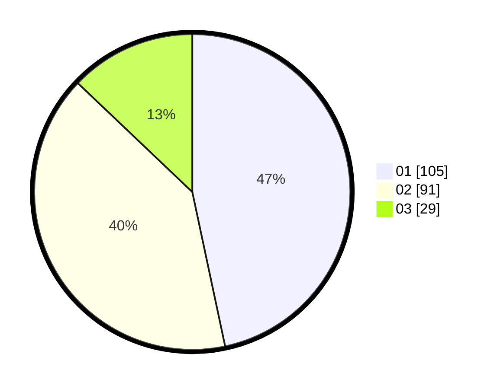

# Hasil

Hasil perolehan suara paslon dapat dilihat pada file paslon-01.txt, paslon-02.txt, dan paslon-03.txt.

Jika tidak ada, artinya data tersebut belum ada pada SIREKAP.

## Perolehan Suara

 * Paslon 01: **105**.
 * Paslon 02: **91**.
 * Paslon 03: **29**.

## Foto C Plano

https://sirekap-obj-formc.kpu.go.id/2267/pemilu/ppwp/31/75/05/10/04/3175051004037-20240214-233307--eee23e62-791a-4b3e-a3f0-6d8e9d567fdf.jpg

https://sirekap-obj-formc.kpu.go.id/2267/pemilu/ppwp/31/75/05/10/04/3175051004037-20240214-232902--ff5f984f-2f69-42bb-9c01-848e07d18e58.jpg

https://sirekap-obj-formc.kpu.go.id/2267/pemilu/ppwp/31/75/05/10/04/3175051004037-20240214-232759--663f948e-4586-4f0c-a360-021509cc679b.jpg

## DATA PEMILIH TETAP

Jumlah pemilih dalam DPT: **281**.
 * L: **131**.
 * P: **150**.

## DATA PENGGUNA HAK PILIH

Jumlah pengguna hak pilih dalam DPT: **230**.
 * L: **97**.
 * P: **133**.

Jumlah pengguna hak pilih dalam DPTb: **0**.
 * L: **0**.
 * P: **0**.

Jumlah pengguna hak pilih dalam DPK: **0**.
 * L: **0**.
 * P: **0**.

Jumlah pengguna hak pilih: **230**.
 * L: **97**.
 * P: **133**.

## JUMLAH SUARA SAH DAN TIDAK SAH

JUMLAH SELURUH SUARA SAH: **225**.

JUMLAH SUARA TIDAK SAH: **5**.

JUMLAH SELURUH SUARA SAH DAN SUARA TIDAK SAH: **230**.
