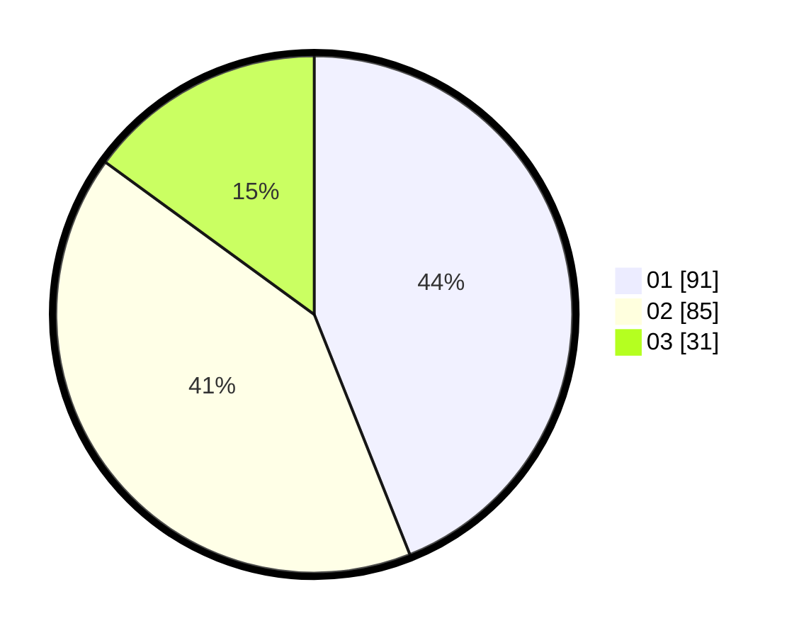

# Hasil

Hasil perolehan suara paslon dapat dilihat pada file paslon-01.txt, paslon-02.txt, dan paslon-03.txt.

Jika tidak ada, artinya data tersebut belum ada pada SIREKAP.

## Perolehan Suara

 * Paslon 01: **91**.
 * Paslon 02: **85**.
 * Paslon 03: **31**.

## Foto C Plano

https://sirekap-obj-formc.kpu.go.id/25da/pemilu/ppwp/31/75/05/10/04/3175051004039-20240214-185457--799d58b9-306e-4c53-a1c5-67d6c066560c.jpg

https://sirekap-obj-formc.kpu.go.id/25da/pemilu/ppwp/31/75/05/10/04/3175051004039-20240214-190514--0e7f6ae0-dfb3-4f17-8a27-152d2bd67725.jpg

https://sirekap-obj-formc.kpu.go.id/25da/pemilu/ppwp/31/75/05/10/04/3175051004039-20240214-190619--0909712e-791d-4c4f-b653-1ed6b8fe294a.jpg

## DATA PEMILIH TETAP

Jumlah pemilih dalam DPT: **288**.
 * L: **139**.
 * P: **149**.

## DATA PENGGUNA HAK PILIH

Jumlah pengguna hak pilih dalam DPT: **207**.
 * L: **95**.
 * P: **112**.

Jumlah pengguna hak pilih dalam DPTb: **2**.
 * L: **2**.
 * P: **0**.

Jumlah pengguna hak pilih dalam DPK: **0**.
 * L: **0**.
 * P: **0**.

Jumlah pengguna hak pilih: **209**.
 * L: **97**.
 * P: **112**.

## JUMLAH SUARA SAH DAN TIDAK SAH

JUMLAH SELURUH SUARA SAH: **207**.

JUMLAH SUARA TIDAK SAH: **2**.

JUMLAH SELURUH SUARA SAH DAN SUARA TIDAK SAH: **209**.
