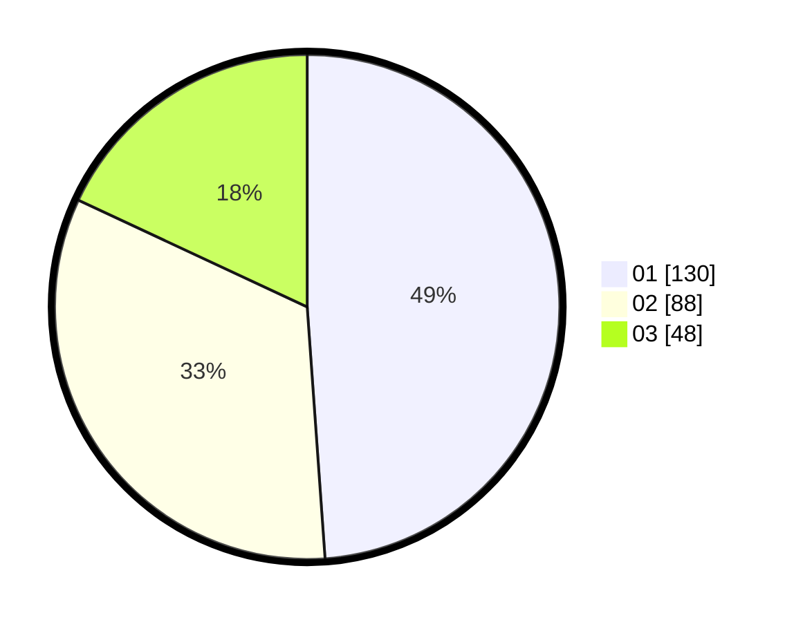

# Hasil

Hasil perolehan suara paslon dapat dilihat pada file paslon-01.txt, paslon-02.txt, dan paslon-03.txt.

Jika tidak ada, artinya data tersebut belum ada pada SIREKAP.

## Perolehan Suara

 * Paslon 01: **130**.
 * Paslon 02: **88**.
 * Paslon 03: **48**.

## Foto C Plano

https://sirekap-obj-formc.kpu.go.id/3003/pemilu/ppwp/31/75/05/10/04/3175051004047-20240215-023232--4af1711f-2ac4-42a7-9193-045c66435743.jpg

https://sirekap-obj-formc.kpu.go.id/3003/pemilu/ppwp/31/75/05/10/04/3175051004047-20240215-015455--bf91ca2e-845a-4fb4-81f5-fe9794fa0b22.jpg

https://sirekap-obj-formc.kpu.go.id/3003/pemilu/ppwp/31/75/05/10/04/3175051004047-20240215-015319--8ab33bab-4ff0-4c86-a559-98150507c4c2.jpg

## DATA PEMILIH TETAP

Jumlah pemilih dalam DPT: **292**.
 * L: **137**.
 * P: **155**.

## DATA PENGGUNA HAK PILIH

Jumlah pengguna hak pilih dalam DPT: **259**.
 * L: **117**.
 * P: **142**.

Jumlah pengguna hak pilih dalam DPTb: **7**.
 * L: **2**.
 * P: **5**.

Jumlah pengguna hak pilih dalam DPK: **3**.
 * L: **1**.
 * P: **2**.

Jumlah pengguna hak pilih: **269**.
 * L: **120**.
 * P: **149**.

## JUMLAH SUARA SAH DAN TIDAK SAH

JUMLAH SELURUH SUARA SAH: **266**.

JUMLAH SUARA TIDAK SAH: **3**.

JUMLAH SELURUH SUARA SAH DAN SUARA TIDAK SAH: **269**.
