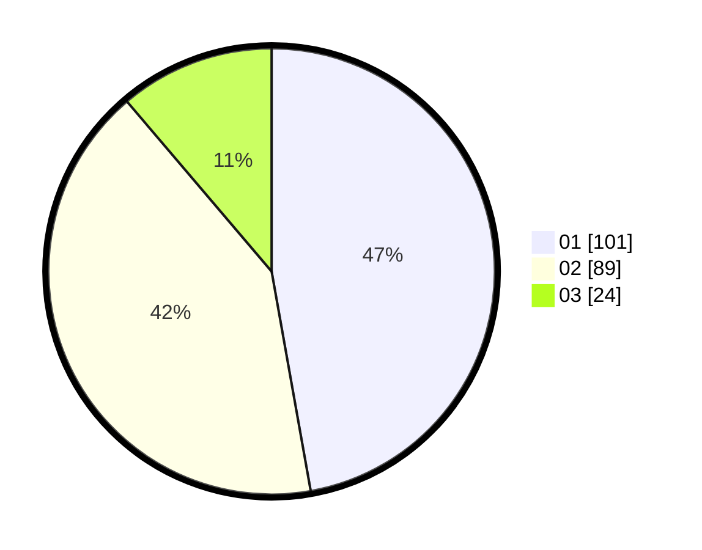

# Hasil

Hasil perolehan suara paslon dapat dilihat pada file paslon-01.txt, paslon-02.txt, dan paslon-03.txt.

Jika tidak ada, artinya data tersebut belum ada pada SIREKAP.

## Perolehan Suara

 * Paslon 01: **101**.
 * Paslon 02: **89**.
 * Paslon 03: **24**.

## Foto C Plano

https://sirekap-obj-formc.kpu.go.id/e6f8/pemilu/ppwp/31/75/05/10/04/3175051004054-20240215-032330--c5b2bafa-ab58-4712-8058-4e2575c3ca38.jpg

https://sirekap-obj-formc.kpu.go.id/e6f8/pemilu/ppwp/31/75/05/10/04/3175051004054-20240215-032334--61f167bf-b0b7-41a0-8dbd-e6a95495dfff.jpg

https://sirekap-obj-formc.kpu.go.id/e6f8/pemilu/ppwp/31/75/05/10/04/3175051004054-20240215-032338--4eb2191f-37a4-4617-a7b8-227063e9c884.jpg
