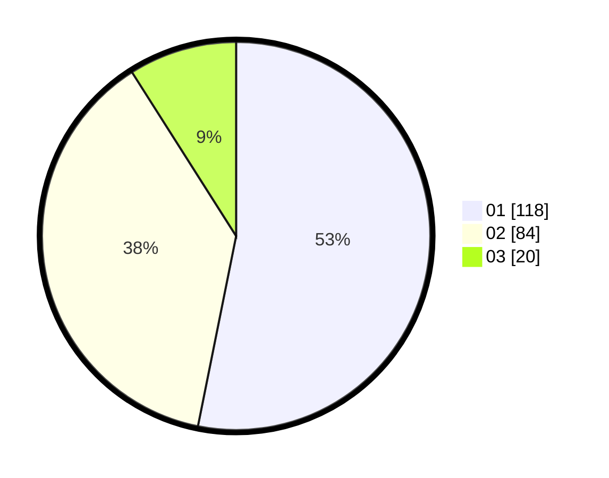

# Hasil

Hasil perolehan suara paslon dapat dilihat pada file paslon-01.txt, paslon-02.txt, dan paslon-03.txt.

Jika tidak ada, artinya data tersebut belum ada pada SIREKAP.

## Perolehan Suara

 * Paslon 01: **118**.
 * Paslon 02: **84**.
 * Paslon 03: **20**.

## Foto C Plano

https://sirekap-obj-formc.kpu.go.id/a359/pemilu/ppwp/31/75/05/10/04/3175051004056-20240214-212722--29af5d1b-1ddf-456e-8f96-93729154724c.jpg

https://sirekap-obj-formc.kpu.go.id/a359/pemilu/ppwp/31/75/05/10/04/3175051004056-20240214-212811--e81035da-aac8-430a-b08f-8b31be8a11d2.jpg

https://sirekap-obj-formc.kpu.go.id/a359/pemilu/ppwp/31/75/05/10/04/3175051004056-20240214-212832--74d7ef12-34b0-4c74-8c91-f50d6836c862.jpg
