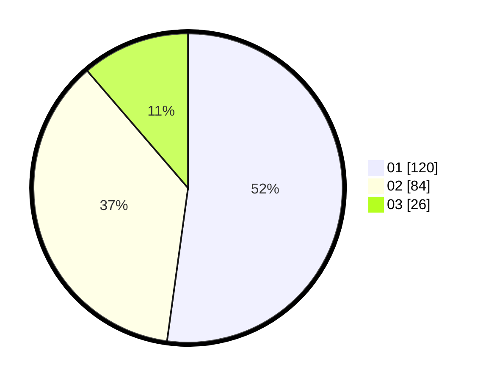

# Hasil

Hasil perolehan suara paslon dapat dilihat pada file paslon-01.txt, paslon-02.txt, dan paslon-03.txt.

Jika tidak ada, artinya data tersebut belum ada pada SIREKAP.

## Perolehan Suara

 * Paslon 01: **120**.
 * Paslon 02: **84**.
 * Paslon 03: **26**.

## Foto C Plano

https://sirekap-obj-formc.kpu.go.id/85f2/pemilu/ppwp/31/75/05/10/04/3175051004058-20240215-205903--b211ecf5-7371-49ed-a1a2-d2631aff520b.jpg

https://sirekap-obj-formc.kpu.go.id/85f2/pemilu/ppwp/31/75/05/10/04/3175051004058-20240215-205905--bdc213b7-c0b8-4c33-9406-c7415b4e9c31.jpg

https://sirekap-obj-formc.kpu.go.id/85f2/pemilu/ppwp/31/75/05/10/04/3175051004058-20240215-205904--d9bb1cfd-8ee1-476e-82e6-a5676e8621be.jpg

## DATA PEMILIH TETAP

Jumlah pemilih dalam DPT: **265**.
 * L: **129**.
 * P: **136**.

## DATA PENGGUNA HAK PILIH

Jumlah pengguna hak pilih dalam DPT: **231**.
 * L: **109**.
 * P: **122**.

Jumlah pengguna hak pilih dalam DPTb: **1**.
 * L: **1**.
 * P: **0**.

Jumlah pengguna hak pilih dalam DPK: **0**.
 * L: **0**.
 * P: **0**.

Jumlah pengguna hak pilih: **232**.
 * L: **110**.
 * P: **122**.

## JUMLAH SUARA SAH DAN TIDAK SAH

JUMLAH SELURUH SUARA SAH: **230**.

JUMLAH SUARA TIDAK SAH: **2**.

JUMLAH SELURUH SUARA SAH DAN SUARA TIDAK SAH: **232**.
