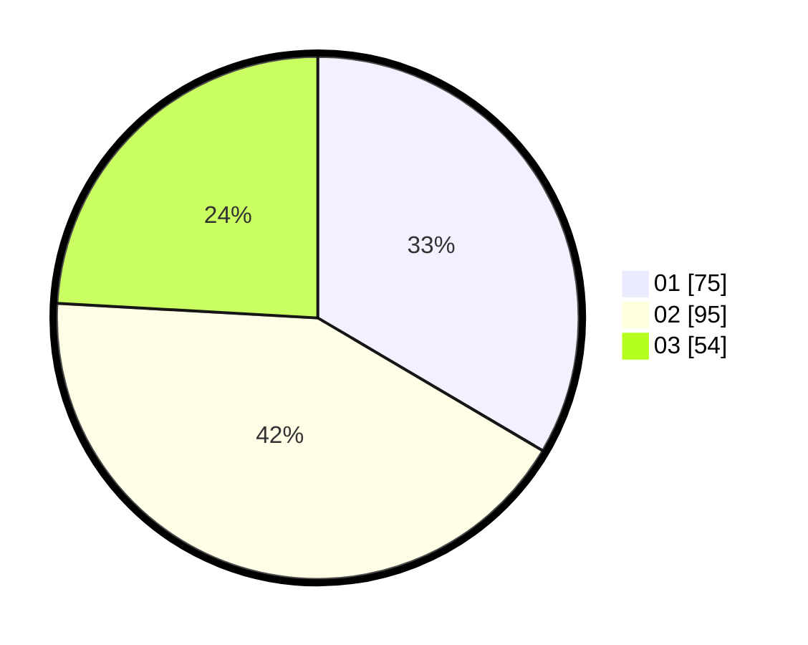

# Hasil

Hasil perolehan suara paslon dapat dilihat pada file paslon-01.txt, paslon-02.txt, dan paslon-03.txt.

Jika tidak ada, artinya data tersebut belum ada pada SIREKAP.

## Perolehan Suara

 * Paslon 01: **75**.
 * Paslon 02: **95**.
 * Paslon 03: **54**.

## Foto C Plano

https://sirekap-obj-formc.kpu.go.id/9d1a/pemilu/ppwp/31/75/05/10/04/3175051004071-20240216-051656--c15c36f0-a6c1-402c-bde3-0c883160585b.jpg

https://sirekap-obj-formc.kpu.go.id/9d1a/pemilu/ppwp/31/75/05/10/04/3175051004071-20240214-195157--85ce31f5-2924-44bb-94d1-fbfe950c5950.jpg

https://sirekap-obj-formc.kpu.go.id/9d1a/pemilu/ppwp/31/75/05/10/04/3175051004071-20240216-051657--1ee6e4b0-392b-4ab2-aef1-827d468ca8c9.jpg

## DATA PEMILIH TETAP

Jumlah pemilih dalam DPT: **280**.
 * L: **133**.
 * P: **147**.

## DATA PENGGUNA HAK PILIH

Jumlah pengguna hak pilih dalam DPT: **227**.
 * L: **103**.
 * P: **124**.

Jumlah pengguna hak pilih dalam DPTb: **0**.
 * L: **0**.
 * P: **0**.

Jumlah pengguna hak pilih dalam DPK: **0**.
 * L: **1**.
 * P: **0**.

Jumlah pengguna hak pilih: **228**.
 * L: **104**.
 * P: **124**.

## JUMLAH SUARA SAH DAN TIDAK SAH

JUMLAH SELURUH SUARA SAH: **224**.

JUMLAH SUARA TIDAK SAH: **4**.

JUMLAH SELURUH SUARA SAH DAN SUARA TIDAK SAH: **228**.
