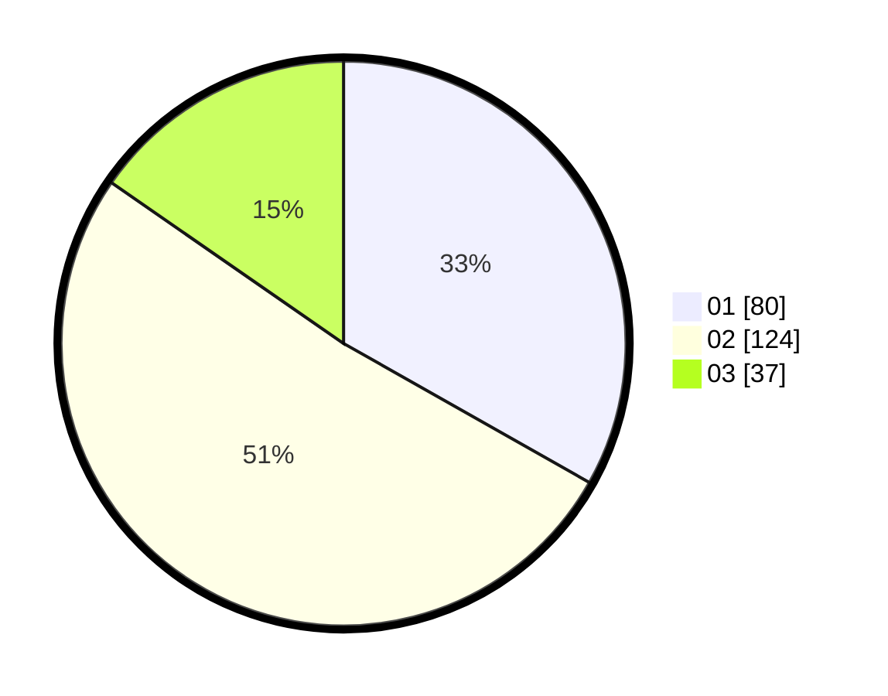

# Hasil

Hasil perolehan suara paslon dapat dilihat pada file paslon-01.txt, paslon-02.txt, dan paslon-03.txt.

Jika tidak ada, artinya data tersebut belum ada pada SIREKAP.

## Perolehan Suara

 * Paslon 01: **80**.
 * Paslon 02: **124**.
 * Paslon 03: **37**.

## Foto C Plano

https://sirekap-obj-formc.kpu.go.id/1715/pemilu/ppwp/31/75/05/10/04/3175051004084-20240214-232316--5f0aaeff-f424-4a00-b389-229ed4fb691c.jpg

https://sirekap-obj-formc.kpu.go.id/1715/pemilu/ppwp/31/75/05/10/04/3175051004084-20240214-232459--cb4759d5-8e3f-440d-833a-b3926ef0b5bf.jpg

https://sirekap-obj-formc.kpu.go.id/1715/pemilu/ppwp/31/75/05/10/04/3175051004084-20240214-232629--860740ff-6c1e-4478-866e-c1455b5b473e.jpg
