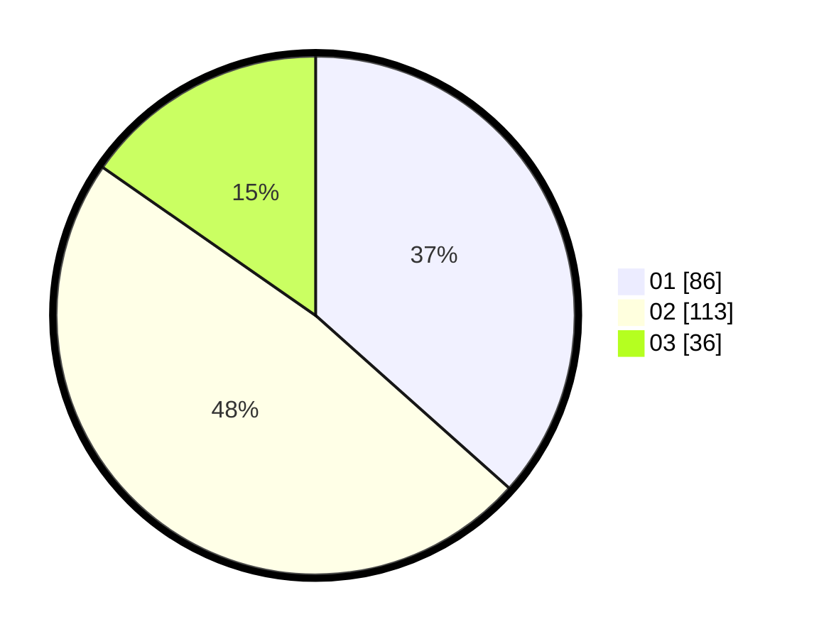

# Hasil

Hasil perolehan suara paslon dapat dilihat pada file paslon-01.txt, paslon-02.txt, dan paslon-03.txt.

Jika tidak ada, artinya data tersebut belum ada pada SIREKAP.

## Perolehan Suara

 * Paslon 01: **86**.
 * Paslon 02: **113**.
 * Paslon 03: **36**.

## Foto C Plano

https://sirekap-obj-formc.kpu.go.id/fef8/pemilu/ppwp/31/75/05/10/04/3175051004085-20240215-030857--2d3fe966-2932-4eda-87d8-7086b302dc60.jpg

https://sirekap-obj-formc.kpu.go.id/fef8/pemilu/ppwp/31/75/05/10/04/3175051004085-20240215-024024--7ac87bb1-84d2-412f-be27-8f8c0aa7b94d.jpg

https://sirekap-obj-formc.kpu.go.id/fef8/pemilu/ppwp/31/75/05/10/04/3175051004085-20240215-030954--56625724-4b54-414a-ae05-d127c3d74fca.jpg

## DATA PEMILIH TETAP

Jumlah pemilih dalam DPT: **293**.
 * L: **140**.
 * P: **153**.

## DATA PENGGUNA HAK PILIH

Jumlah pengguna hak pilih dalam DPT: **235**.
 * L: **112**.
 * P: **123**.

Jumlah pengguna hak pilih dalam DPTb: **0**.
 * L: **0**.
 * P: **0**.

Jumlah pengguna hak pilih dalam DPK: **0**.
 * L: **0**.
 * P: **0**.

Jumlah pengguna hak pilih: **235**.
 * L: **112**.
 * P: **123**.

## JUMLAH SUARA SAH DAN TIDAK SAH

JUMLAH SELURUH SUARA SAH: **235**.

JUMLAH SUARA TIDAK SAH: **5**.

JUMLAH SELURUH SUARA SAH DAN SUARA TIDAK SAH: **235**.
