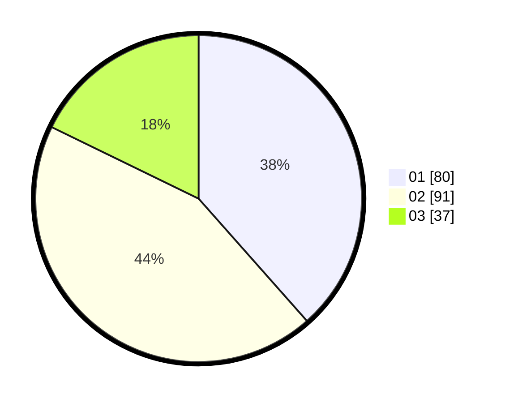

# Hasil

Hasil perolehan suara paslon dapat dilihat pada file paslon-01.txt, paslon-02.txt, dan paslon-03.txt.

Jika tidak ada, artinya data tersebut belum ada pada SIREKAP.

## Perolehan Suara

 * Paslon 01: **80**.
 * Paslon 02: **91**.
 * Paslon 03: **37**.

## Foto C Plano

https://sirekap-obj-formc.kpu.go.id/0b35/pemilu/ppwp/31/75/05/10/04/3175051004114-20240215-201038--022eddd1-0a46-4166-a4d7-42fcd9b37478.jpg

https://sirekap-obj-formc.kpu.go.id/0b35/pemilu/ppwp/31/75/05/10/04/3175051004114-20240215-201112--186561b8-c514-48ce-b8f5-60e6d28cb121.jpg

https://sirekap-obj-formc.kpu.go.id/0b35/pemilu/ppwp/31/75/05/10/04/3175051004114-20240215-203002--abc506c9-d191-4cc9-bc27-bf5aab58d5ac.jpg
