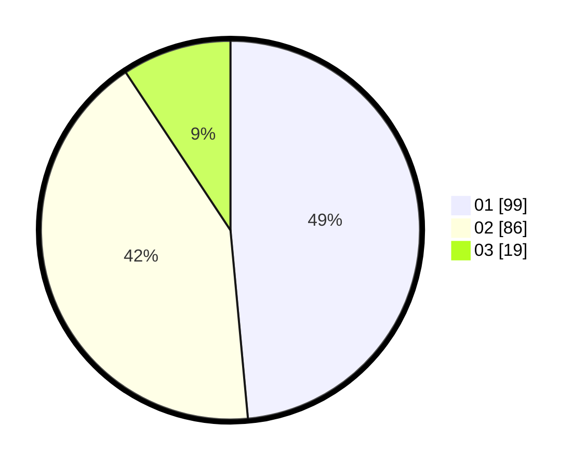

# Hasil

Hasil perolehan suara paslon dapat dilihat pada file paslon-01.txt, paslon-02.txt, dan paslon-03.txt.

Jika tidak ada, artinya data tersebut belum ada pada SIREKAP.

## Perolehan Suara

 * Paslon 01: **99**.
 * Paslon 02: **86**.
 * Paslon 03: **19**.

## Foto C Plano

https://sirekap-obj-formc.kpu.go.id/293a/pemilu/ppwp/31/75/05/10/04/3175051004115-20240216-133517--02313d1f-3ffc-4e49-ab43-c32840a399ce.jpg

https://sirekap-obj-formc.kpu.go.id/293a/pemilu/ppwp/31/75/05/10/04/3175051004115-20240214-192433--a8405d99-311c-4a79-8c14-d703108e7b42.jpg

https://sirekap-obj-formc.kpu.go.id/293a/pemilu/ppwp/31/75/05/10/04/3175051004115-20240214-192445--c44b9dff-527b-4635-a8b7-e4c3871ad8a0.jpg

## DATA PEMILIH TETAP

Jumlah pemilih dalam DPT: **265**.
 * L: **129**.
 * P: **136**.

## DATA PENGGUNA HAK PILIH

Jumlah pengguna hak pilih dalam DPT: **202**.
 * L: **94**.
 * P: **108**.

Jumlah pengguna hak pilih dalam DPTb: **4**.
 * L: **2**.
 * P: **2**.

Jumlah pengguna hak pilih dalam DPK: **0**.
 * L: **0**.
 * P: **0**.

Jumlah pengguna hak pilih: **206**.
 * L: **96**.
 * P: **110**.

## JUMLAH SUARA SAH DAN TIDAK SAH

JUMLAH SELURUH SUARA SAH: **204**.

JUMLAH SUARA TIDAK SAH: **2**.

JUMLAH SELURUH SUARA SAH DAN SUARA TIDAK SAH: **206**.
