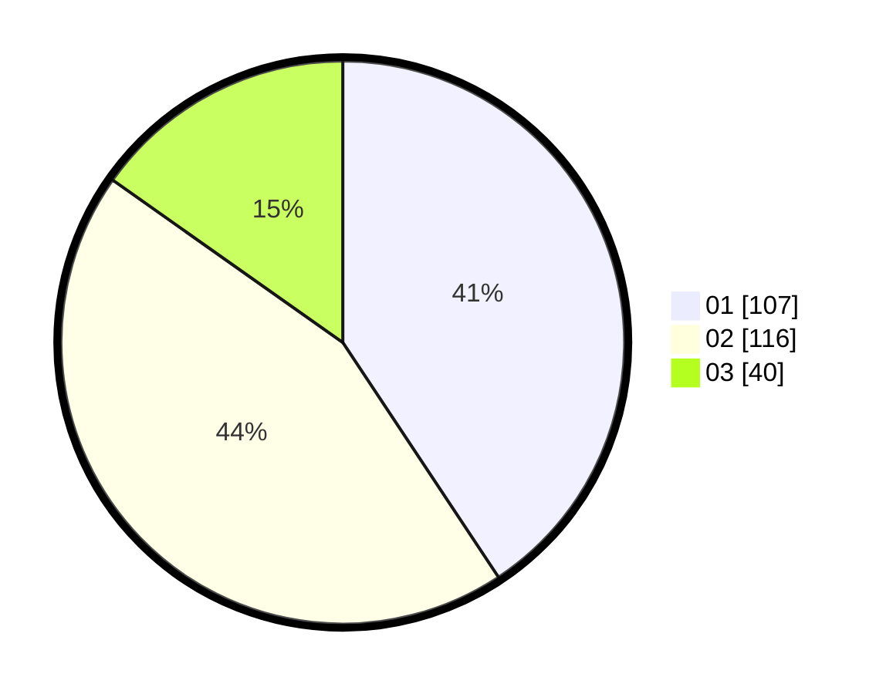

# Hasil

Hasil perolehan suara paslon dapat dilihat pada file paslon-01.txt, paslon-02.txt, dan paslon-03.txt.

Jika tidak ada, artinya data tersebut belum ada pada SIREKAP.

## Perolehan Suara

 * Paslon 01: **107**.
 * Paslon 02: **116**.
 * Paslon 03: **40**.

## Foto C Plano

https://sirekap-obj-formc.kpu.go.id/ba49/pemilu/ppwp/31/75/05/10/04/3175051004127-20240214-155649--2909243b-427a-4a8f-a107-e135955a7aeb.jpg

https://sirekap-obj-formc.kpu.go.id/ba49/pemilu/ppwp/31/75/05/10/04/3175051004127-20240214-201530--47cd1ca9-8e7f-43bd-b617-c54cddc7f8ef.jpg

https://sirekap-obj-formc.kpu.go.id/ba49/pemilu/ppwp/31/75/05/10/04/3175051004127-20240214-155431--c52c8045-5d86-4356-bdd0-7cde7e359497.jpg

## DATA PEMILIH TETAP

Jumlah pemilih dalam DPT: **256**.
 * L: **126**.
 * P: **130**.

## DATA PENGGUNA HAK PILIH

Jumlah pengguna hak pilih dalam DPT: **256**.
 * L: **126**.
 * P: **130**.

Jumlah pengguna hak pilih dalam DPTb: **4**.
 * L: **2**.
 * P: **2**.

Jumlah pengguna hak pilih dalam DPK: **3**.
 * L: **1**.
 * P: **2**.

Jumlah pengguna hak pilih: **263**.
 * L: **129**.
 * P: **134**.

## JUMLAH SUARA SAH DAN TIDAK SAH

JUMLAH SELURUH SUARA SAH: **263**.

JUMLAH SUARA TIDAK SAH: **0**.

JUMLAH SELURUH SUARA SAH DAN SUARA TIDAK SAH: **263**.
