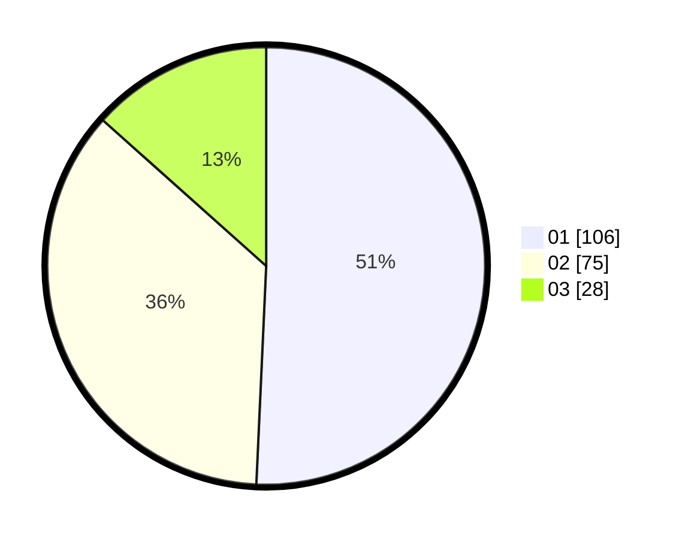

# Hasil

Hasil perolehan suara paslon dapat dilihat pada file paslon-01.txt, paslon-02.txt, dan paslon-03.txt.

Jika tidak ada, artinya data tersebut belum ada pada SIREKAP.

## Perolehan Suara

 * Paslon 01: **106**.
 * Paslon 02: **75**.
 * Paslon 03: **28**.

## Foto C Plano

https://sirekap-obj-formc.kpu.go.id/6dcc/pemilu/ppwp/31/75/05/10/04/3175051004129-20240214-222320--8f0b8ca3-72f9-4667-9c71-d1fdf2eae101.jpg

https://sirekap-obj-formc.kpu.go.id/6dcc/pemilu/ppwp/31/75/05/10/04/3175051004129-20240214-222504--e76fd931-9d15-431e-964d-8e41b7424423.jpg

https://sirekap-obj-formc.kpu.go.id/6dcc/pemilu/ppwp/31/75/05/10/04/3175051004129-20240214-222613--54c7d8f3-1b09-4cf6-94a7-8f9e007862a6.jpg
