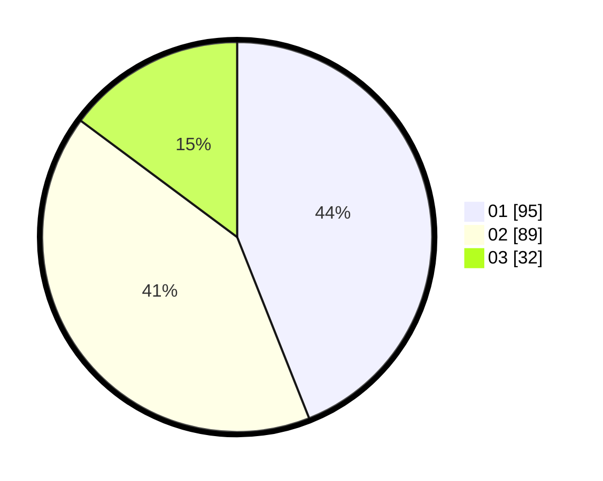

# Hasil

Hasil perolehan suara paslon dapat dilihat pada file paslon-01.txt, paslon-02.txt, dan paslon-03.txt.

Jika tidak ada, artinya data tersebut belum ada pada SIREKAP.

## Perolehan Suara

 * Paslon 01: **95**.
 * Paslon 02: **89**.
 * Paslon 03: **32**.

## Foto C Plano

https://sirekap-obj-formc.kpu.go.id/46a5/pemilu/ppwp/31/75/05/10/04/3175051004132-20240215-042306--a221e121-0708-4c15-8333-c7a7f047a740.jpg

https://sirekap-obj-formc.kpu.go.id/46a5/pemilu/ppwp/31/75/05/10/04/3175051004132-20240215-042552--942cab27-e3c8-4203-b222-7ad789489ef6.jpg
