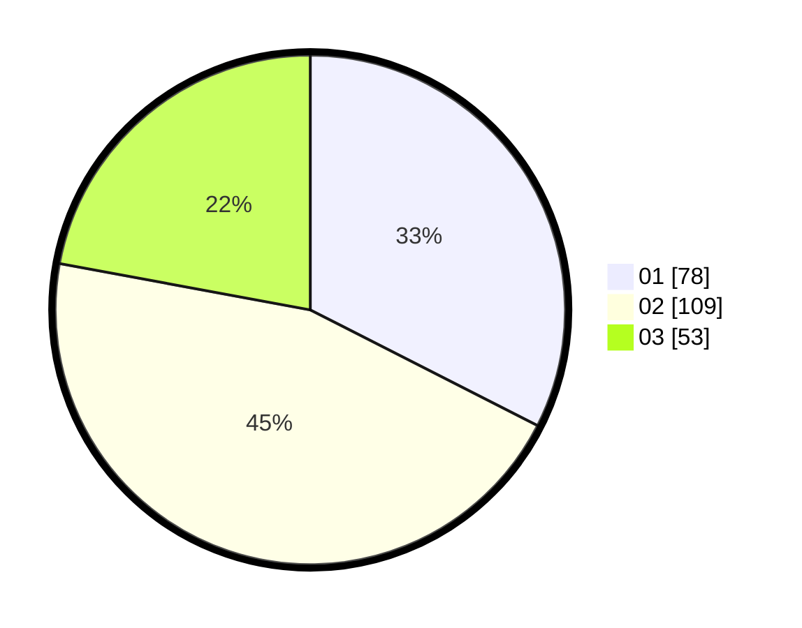

# Hasil

Hasil perolehan suara paslon dapat dilihat pada file paslon-01.txt, paslon-02.txt, dan paslon-03.txt.

Jika tidak ada, artinya data tersebut belum ada pada SIREKAP.

## Perolehan Suara

 * Paslon 01: **78**.
 * Paslon 02: **109**.
 * Paslon 03: **53**.

## Foto C Plano

https://sirekap-obj-formc.kpu.go.id/ba31/pemilu/ppwp/31/75/05/10/04/3175051004136-20240214-185636--ff44121a-5610-4499-a2a4-c94d83cc94d6.jpg

https://sirekap-obj-formc.kpu.go.id/ba31/pemilu/ppwp/31/75/05/10/04/3175051004136-20240214-185653--f9cfcb34-b222-42c2-b8fd-73571a7bef8e.jpg

https://sirekap-obj-formc.kpu.go.id/ba31/pemilu/ppwp/31/75/05/10/04/3175051004136-20240215-003347--59342df9-675c-40a5-9b45-e8874b78d151.jpg
