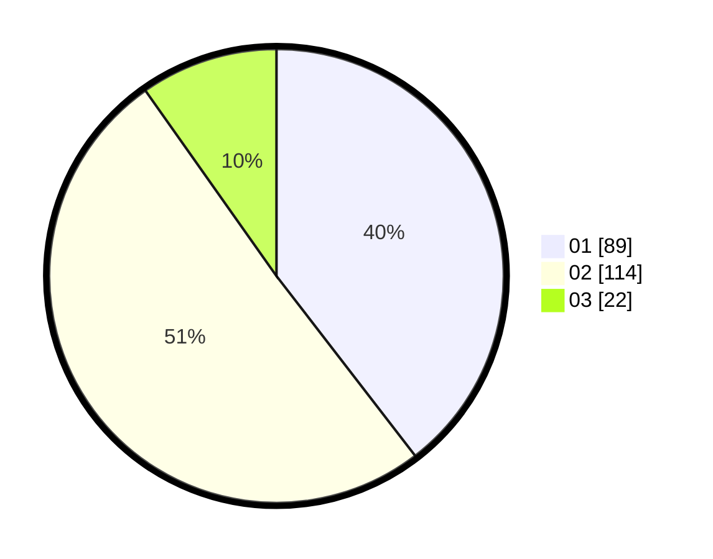

# Hasil

Hasil perolehan suara paslon dapat dilihat pada file paslon-01.txt, paslon-02.txt, dan paslon-03.txt.

Jika tidak ada, artinya data tersebut belum ada pada SIREKAP.

## Perolehan Suara

 * Paslon 01: **89**.
 * Paslon 02: **114**.
 * Paslon 03: **22**.

## Foto C Plano

https://sirekap-obj-formc.kpu.go.id/7427/pemilu/ppwp/31/75/05/10/04/3175051004137-20240214-234030--f71e3078-612f-4144-bf6f-d7986d6da5a7.jpg

https://sirekap-obj-formc.kpu.go.id/7427/pemilu/ppwp/31/75/05/10/04/3175051004137-20240214-234257--4f4ca507-2c88-47f2-9581-0dde7930f9f5.jpg

https://sirekap-obj-formc.kpu.go.id/7427/pemilu/ppwp/31/75/05/10/04/3175051004137-20240214-234609--b1feaee3-bd23-45fc-bf4c-dfb0b19a85a3.jpg

## DATA PEMILIH TETAP

Jumlah pemilih dalam DPT: **288**.
 * L: **131**.
 * P: **157**.

## DATA PENGGUNA HAK PILIH

Jumlah pengguna hak pilih dalam DPT: **221**.
 * L: **96**.
 * P: **125**.

Jumlah pengguna hak pilih dalam DPTb: **2**.
 * L: **1**.
 * P: **1**.

Jumlah pengguna hak pilih dalam DPK: **3**.
 * L: **2**.
 * P: **1**.

Jumlah pengguna hak pilih: **226**.
 * L: **99**.
 * P: **127**.

## JUMLAH SUARA SAH DAN TIDAK SAH

JUMLAH SELURUH SUARA SAH: **225**.

JUMLAH SUARA TIDAK SAH: **1**.

JUMLAH SELURUH SUARA SAH DAN SUARA TIDAK SAH: **226**.
