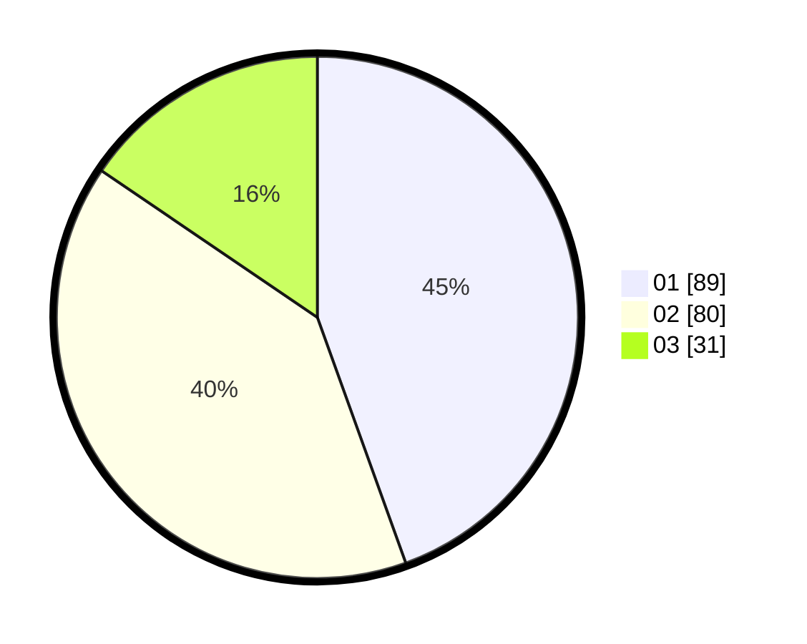

# Hasil

Hasil perolehan suara paslon dapat dilihat pada file paslon-01.txt, paslon-02.txt, dan paslon-03.txt.

Jika tidak ada, artinya data tersebut belum ada pada SIREKAP.

## Perolehan Suara

 * Paslon 01: **89**.
 * Paslon 02: **80**.
 * Paslon 03: **31**.

## Foto C Plano

https://sirekap-obj-formc.kpu.go.id/9765/pemilu/ppwp/31/75/05/10/04/3175051004139-20240217-010356--55fb1e56-7459-4696-bd14-f998c6ac980c.jpg

https://sirekap-obj-formc.kpu.go.id/9765/pemilu/ppwp/31/75/05/10/04/3175051004139-20240214-155008--16af4aea-f7fe-434f-8930-40cbc6d723ea.jpg

https://sirekap-obj-formc.kpu.go.id/9765/pemilu/ppwp/31/75/05/10/04/3175051004139-20240214-155041--2fe43d46-430f-4d64-9eaa-9254f44a76ef.jpg

## DATA PEMILIH TETAP

Jumlah pemilih dalam DPT: **245**.
 * L: **121**.
 * P: **124**.

## DATA PENGGUNA HAK PILIH

Jumlah pengguna hak pilih dalam DPT: **196**.
 * L: **96**.
 * P: **100**.

Jumlah pengguna hak pilih dalam DPTb: **3**.
 * L: **2**.
 * P: **1**.

Jumlah pengguna hak pilih dalam DPK: **3**.
 * L: **1**.
 * P: **2**.

Jumlah pengguna hak pilih: **202**.
 * L: **99**.
 * P: **103**.

## JUMLAH SUARA SAH DAN TIDAK SAH

JUMLAH SELURUH SUARA SAH: **200**.

JUMLAH SUARA TIDAK SAH: **2**.

JUMLAH SELURUH SUARA SAH DAN SUARA TIDAK SAH: **202**.
