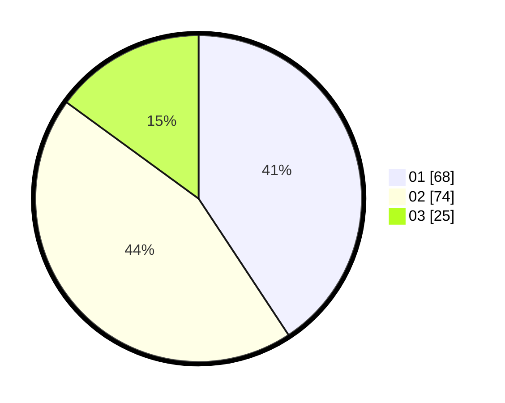

# Hasil

Hasil perolehan suara paslon dapat dilihat pada file paslon-01.txt, paslon-02.txt, dan paslon-03.txt.

Jika tidak ada, artinya data tersebut belum ada pada SIREKAP.

## Perolehan Suara

 * Paslon 01: **68**.
 * Paslon 02: **74**.
 * Paslon 03: **25**.

## Foto C Plano

https://sirekap-obj-formc.kpu.go.id/2c15/pemilu/ppwp/31/75/05/10/04/3175051004140-20240214-184659--056f20de-19f9-4931-b628-015aeb19320d.jpg

https://sirekap-obj-formc.kpu.go.id/2c15/pemilu/ppwp/31/75/05/10/04/3175051004140-20240214-184704--6f39ee88-dedf-420c-9c99-5346fb1b2781.jpg

https://sirekap-obj-formc.kpu.go.id/2c15/pemilu/ppwp/31/75/05/10/04/3175051004140-20240214-184707--47418811-806e-4fc5-a94d-9101a4c59899.jpg

## DATA PEMILIH TETAP

Jumlah pemilih dalam DPT: **244**.
 * L: **177**.
 * P: **127**.

## DATA PENGGUNA HAK PILIH

Jumlah pengguna hak pilih dalam DPT: **166**.
 * L: **79**.
 * P: **87**.

Jumlah pengguna hak pilih dalam DPTb: **2**.
 * L: **1**.
 * P: **1**.

Jumlah pengguna hak pilih dalam DPK: **0**.
 * L: **0**.
 * P: **0**.

Jumlah pengguna hak pilih: **168**.
 * L: **80**.
 * P: **88**.

## JUMLAH SUARA SAH DAN TIDAK SAH

JUMLAH SELURUH SUARA SAH: **167**.

JUMLAH SUARA TIDAK SAH: **1**.

JUMLAH SELURUH SUARA SAH DAN SUARA TIDAK SAH: **168**.
