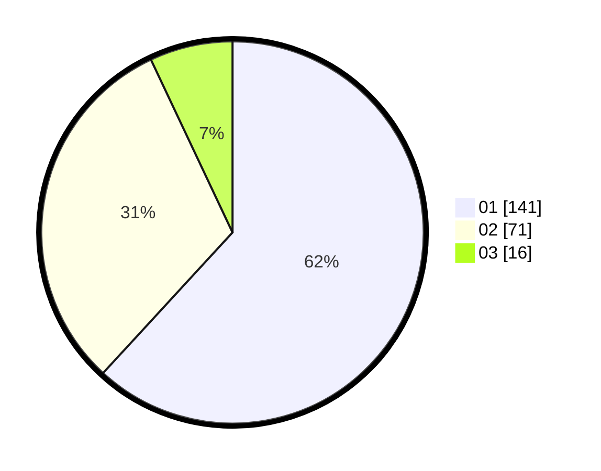

# Hasil

Hasil perolehan suara paslon dapat dilihat pada file paslon-01.txt, paslon-02.txt, dan paslon-03.txt.

Jika tidak ada, artinya data tersebut belum ada pada SIREKAP.

## Perolehan Suara

 * Paslon 01: **141**.
 * Paslon 02: **71**.
 * Paslon 03: **16**.

## Foto C Plano

https://sirekap-obj-formc.kpu.go.id/475a/pemilu/ppwp/31/75/05/10/05/3175051005004-20240214-195838--9324aff9-799c-44a2-bc21-2db2478b89c3.jpg

https://sirekap-obj-formc.kpu.go.id/475a/pemilu/ppwp/31/75/05/10/05/3175051005004-20240215-005118--44d4920e-9fd2-452d-bdc5-7ad09eb3b5c7.jpg

https://sirekap-obj-formc.kpu.go.id/475a/pemilu/ppwp/31/75/05/10/05/3175051005004-20240214-195907--5800fb1d-b19e-4151-9ae2-0c0537a99da2.jpg

## DATA PEMILIH TETAP

Jumlah pemilih dalam DPT: **272**.
 * L: **136**.
 * P: **136**.

## DATA PENGGUNA HAK PILIH

Jumlah pengguna hak pilih dalam DPT: **228**.
 * L: **107**.
 * P: **121**.

Jumlah pengguna hak pilih dalam DPTb: **0**.
 * L: **0**.
 * P: **0**.

Jumlah pengguna hak pilih dalam DPK: **6**.
 * L: **2**.
 * P: **4**.

Jumlah pengguna hak pilih: **234**.
 * L: **109**.
 * P: **125**.

## JUMLAH SUARA SAH DAN TIDAK SAH

JUMLAH SELURUH SUARA SAH: **228**.

JUMLAH SUARA TIDAK SAH: **6**.

JUMLAH SELURUH SUARA SAH DAN SUARA TIDAK SAH: **234**.
