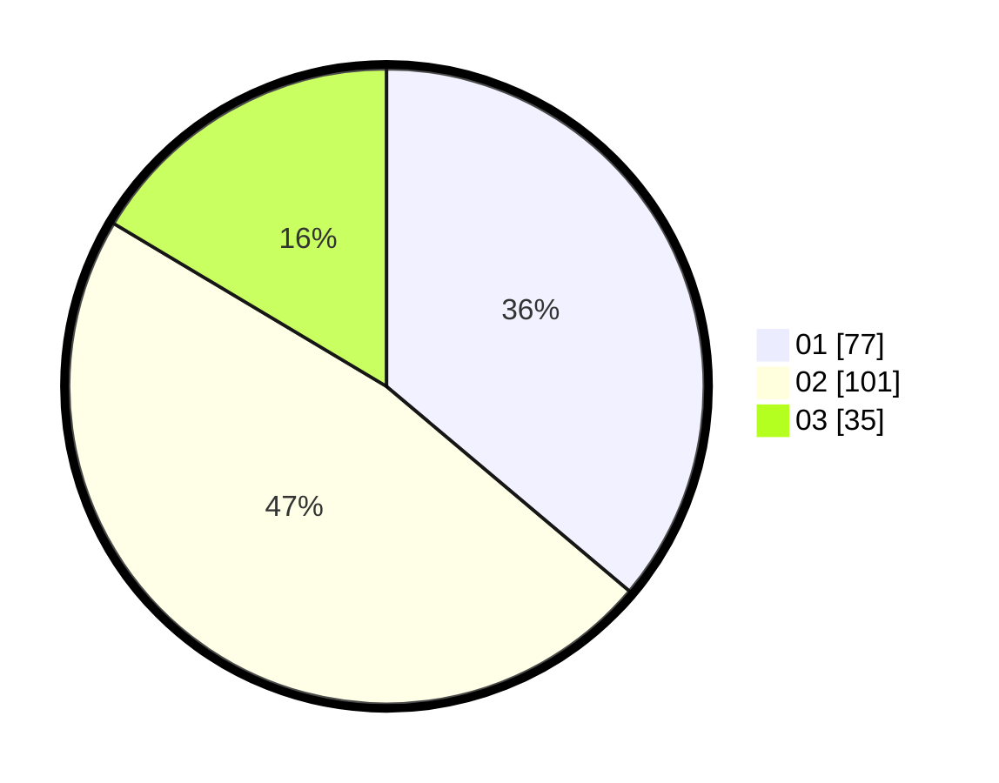

# Hasil

Hasil perolehan suara paslon dapat dilihat pada file paslon-01.txt, paslon-02.txt, dan paslon-03.txt.

Jika tidak ada, artinya data tersebut belum ada pada SIREKAP.

## Perolehan Suara

 * Paslon 01: **77**.
 * Paslon 02: **101**.
 * Paslon 03: **35**.

## Foto C Plano

https://sirekap-obj-formc.kpu.go.id/4ea2/pemilu/ppwp/31/75/05/10/05/3175051005008-20240214-232456--4194fd06-5707-463f-9f30-b6d1b9ec470f.jpg

https://sirekap-obj-formc.kpu.go.id/4ea2/pemilu/ppwp/31/75/05/10/05/3175051005008-20240214-232627--1c44a78e-0fb7-4a8b-a37d-ba40b070a35c.jpg

https://sirekap-obj-formc.kpu.go.id/4ea2/pemilu/ppwp/31/75/05/10/05/3175051005008-20240214-232732--965aeeb2-e44b-41b3-b2d9-47ca1bb9fc41.jpg

## DATA PEMILIH TETAP

Jumlah pemilih dalam DPT: **267**.
 * L: **133**.
 * P: **134**.

## DATA PENGGUNA HAK PILIH

Jumlah pengguna hak pilih dalam DPT: **212**.
 * L: **98**.
 * P: **114**.

Jumlah pengguna hak pilih dalam DPTb: **2**.
 * L: **2**.
 * P: **0**.

Jumlah pengguna hak pilih dalam DPK: **0**.
 * L: **0**.
 * P: **0**.

Jumlah pengguna hak pilih: **214**.
 * L: **100**.
 * P: **114**.

## JUMLAH SUARA SAH DAN TIDAK SAH

JUMLAH SELURUH SUARA SAH: **213**.

JUMLAH SUARA TIDAK SAH: **1**.

JUMLAH SELURUH SUARA SAH DAN SUARA TIDAK SAH: **214**.
