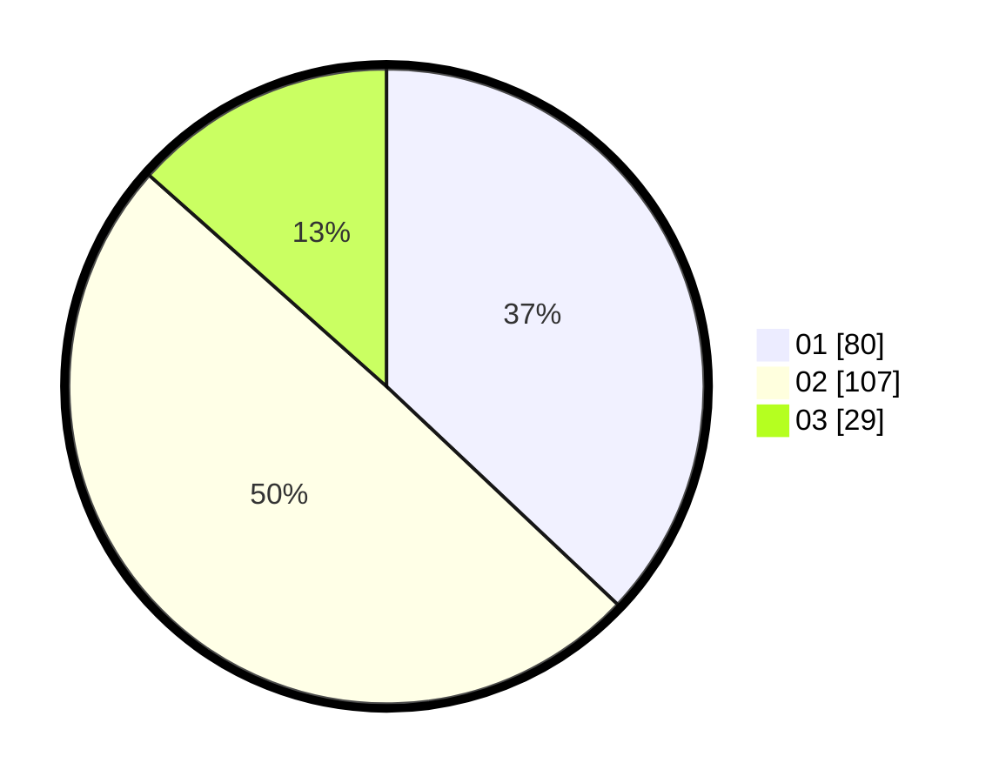

# Hasil

Hasil perolehan suara paslon dapat dilihat pada file paslon-01.txt, paslon-02.txt, dan paslon-03.txt.

Jika tidak ada, artinya data tersebut belum ada pada SIREKAP.

## Perolehan Suara

 * Paslon 01: **80**.
 * Paslon 02: **107**.
 * Paslon 03: **29**.

## Foto C Plano

https://sirekap-obj-formc.kpu.go.id/0a1c/pemilu/ppwp/31/75/05/10/05/3175051005009-20240214-191046--0179df57-0e3e-4a4e-bef2-5e56e762d7a8.jpg

https://sirekap-obj-formc.kpu.go.id/0a1c/pemilu/ppwp/31/75/05/10/05/3175051005009-20240214-190302--fe47afcf-b02e-4bfd-9c84-27a46e69d428.jpg

https://sirekap-obj-formc.kpu.go.id/0a1c/pemilu/ppwp/31/75/05/10/05/3175051005009-20240214-190404--c7e3879e-b8f3-4715-872a-4ddf2df376c9.jpg

## DATA PEMILIH TETAP

Jumlah pemilih dalam DPT: **268**.
 * L: **126**.
 * P: **142**.

## DATA PENGGUNA HAK PILIH

Jumlah pengguna hak pilih dalam DPT: **219**.
 * L: **98**.
 * P: **121**.

Jumlah pengguna hak pilih dalam DPTb: **0**.
 * L: **0**.
 * P: **0**.

Jumlah pengguna hak pilih dalam DPK: **0**.
 * L: **0**.
 * P: **0**.

Jumlah pengguna hak pilih: **219**.
 * L: **98**.
 * P: **121**.

## JUMLAH SUARA SAH DAN TIDAK SAH

JUMLAH SELURUH SUARA SAH: **216**.

JUMLAH SUARA TIDAK SAH: **3**.

JUMLAH SELURUH SUARA SAH DAN SUARA TIDAK SAH: **219**.
