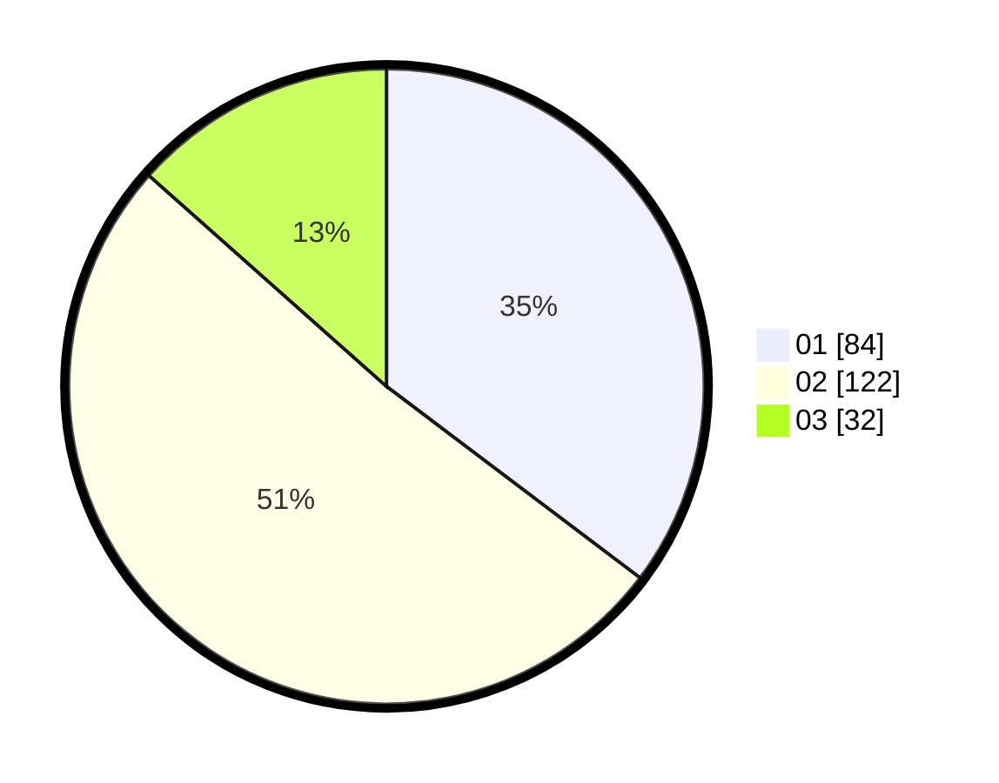

# Hasil

Hasil perolehan suara paslon dapat dilihat pada file paslon-01.txt, paslon-02.txt, dan paslon-03.txt.

Jika tidak ada, artinya data tersebut belum ada pada SIREKAP.

## Perolehan Suara

 * Paslon 01: **84**.
 * Paslon 02: **122**.
 * Paslon 03: **32**.

## Foto C Plano

https://sirekap-obj-formc.kpu.go.id/7bf8/pemilu/ppwp/31/75/05/10/05/3175051005019-20240214-162219--507574a7-c7b5-4d71-b257-728595185616.jpg

https://sirekap-obj-formc.kpu.go.id/7bf8/pemilu/ppwp/31/75/05/10/05/3175051005019-20240214-162226--8b2db0d9-0d49-4fe4-ac96-2a9b73f8890a.jpg

https://sirekap-obj-formc.kpu.go.id/7bf8/pemilu/ppwp/31/75/05/10/05/3175051005019-20240214-162233--b36ec71e-4589-4a56-8c10-5c3d893da169.jpg

## DATA PEMILIH TETAP

Jumlah pemilih dalam DPT: **294**.
 * L: **148**.
 * P: **146**.

## DATA PENGGUNA HAK PILIH

Jumlah pengguna hak pilih dalam DPT: **240**.
 * L: **113**.
 * P: **127**.

Jumlah pengguna hak pilih dalam DPTb: **0**.
 * L: **0**.
 * P: **0**.

Jumlah pengguna hak pilih dalam DPK: **0**.
 * L: **0**.
 * P: **0**.

Jumlah pengguna hak pilih: **240**.
 * L: **113**.
 * P: **127**.

## JUMLAH SUARA SAH DAN TIDAK SAH

JUMLAH SELURUH SUARA SAH: **238**.

JUMLAH SUARA TIDAK SAH: **2**.

JUMLAH SELURUH SUARA SAH DAN SUARA TIDAK SAH: **240**.
