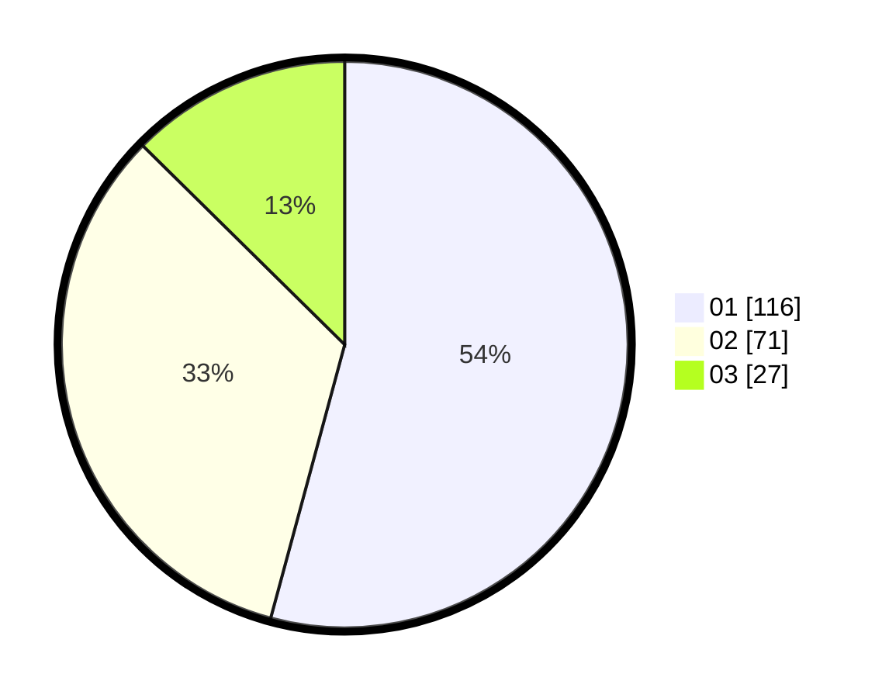

# Hasil

Hasil perolehan suara paslon dapat dilihat pada file paslon-01.txt, paslon-02.txt, dan paslon-03.txt.

Jika tidak ada, artinya data tersebut belum ada pada SIREKAP.

## Perolehan Suara

 * Paslon 01: **116**.
 * Paslon 02: **71**.
 * Paslon 03: **27**.

## Foto C Plano

https://sirekap-obj-formc.kpu.go.id/be94/pemilu/ppwp/31/75/05/10/05/3175051005020-20240215-082630--cd4bcb78-8823-4d7d-b749-9b8434330577.jpg

https://sirekap-obj-formc.kpu.go.id/be94/pemilu/ppwp/31/75/05/10/05/3175051005020-20240214-232301--78de42a1-b2e1-4e31-b8d1-ab2f3ae49744.jpg

https://sirekap-obj-formc.kpu.go.id/be94/pemilu/ppwp/31/75/05/10/05/3175051005020-20240214-232337--bcfb0ec0-a5e0-4690-a910-4049a47ec57d.jpg
