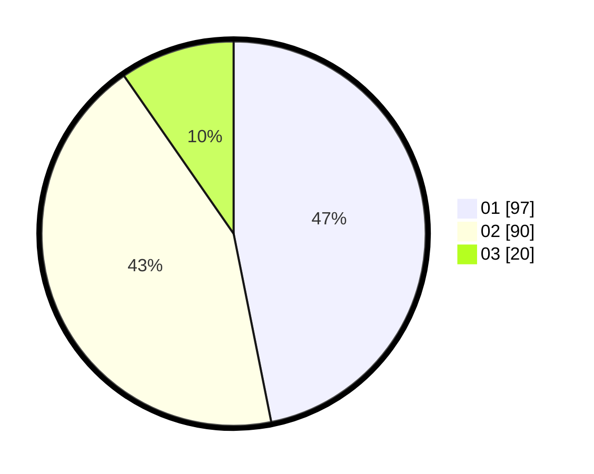

# Hasil

Hasil perolehan suara paslon dapat dilihat pada file paslon-01.txt, paslon-02.txt, dan paslon-03.txt.

Jika tidak ada, artinya data tersebut belum ada pada SIREKAP.

## Perolehan Suara

 * Paslon 01: **97**.
 * Paslon 02: **90**.
 * Paslon 03: **20**.

## Foto C Plano

https://sirekap-obj-formc.kpu.go.id/848d/pemilu/ppwp/31/75/05/10/05/3175051005022-20240215-153624--7fce1ad6-e5f4-474e-873d-23c9612d4cb8.jpg

https://sirekap-obj-formc.kpu.go.id/848d/pemilu/ppwp/31/75/05/10/05/3175051005022-20240215-153645--adde5c0a-383f-4bee-96c1-df673011ac53.jpg

https://sirekap-obj-formc.kpu.go.id/848d/pemilu/ppwp/31/75/05/10/05/3175051005022-20240215-153635--bc644a52-9439-4197-9041-58a2ef691677.jpg

## DATA PEMILIH TETAP

Jumlah pemilih dalam DPT: **256**.
 * L: **113**.
 * P: **143**.

## DATA PENGGUNA HAK PILIH

Jumlah pengguna hak pilih dalam DPT: **208**.
 * L: **81**.
 * P: **127**.

Jumlah pengguna hak pilih dalam DPTb: **0**.
 * L: **0**.
 * P: **0**.

Jumlah pengguna hak pilih dalam DPK: **0**.
 * L: **0**.
 * P: **0**.

Jumlah pengguna hak pilih: **208**.
 * L: **81**.
 * P: **127**.

## JUMLAH SUARA SAH DAN TIDAK SAH

JUMLAH SELURUH SUARA SAH: **207**.

JUMLAH SUARA TIDAK SAH: **1**.

JUMLAH SELURUH SUARA SAH DAN SUARA TIDAK SAH: **208**.
