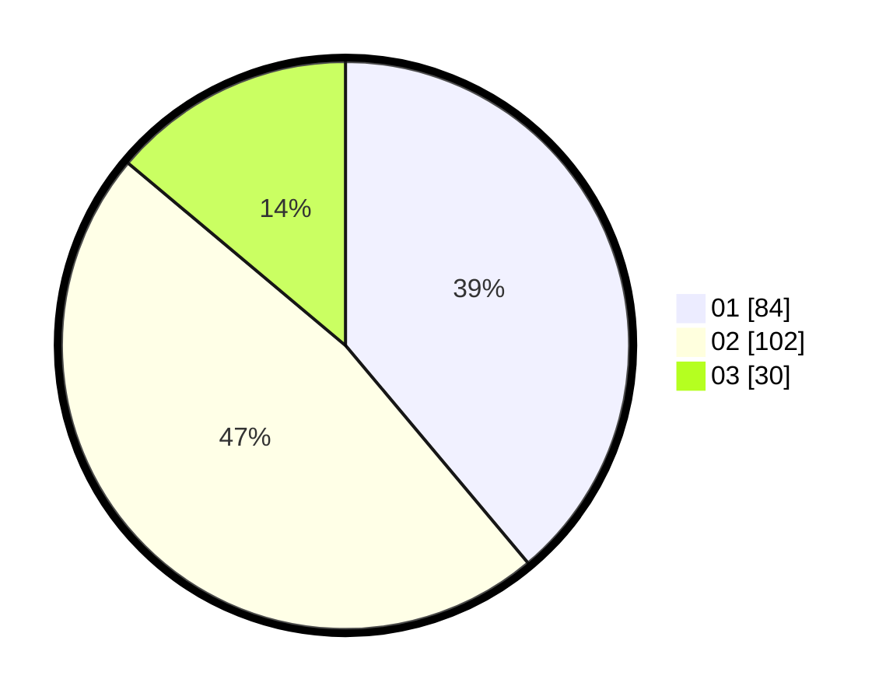

# Hasil

Hasil perolehan suara paslon dapat dilihat pada file paslon-01.txt, paslon-02.txt, dan paslon-03.txt.

Jika tidak ada, artinya data tersebut belum ada pada SIREKAP.

## Perolehan Suara

 * Paslon 01: **84**.
 * Paslon 02: **102**.
 * Paslon 03: **30**.

## Foto C Plano

https://sirekap-obj-formc.kpu.go.id/8033/pemilu/ppwp/31/75/05/10/05/3175051005026-20240214-212735--e97c8a40-5033-453b-8bb8-bec1200382cc.jpg

https://sirekap-obj-formc.kpu.go.id/8033/pemilu/ppwp/31/75/05/10/05/3175051005026-20240214-211736--476ae546-aec7-47c6-8a55-ffc88e5a0a13.jpg

https://sirekap-obj-formc.kpu.go.id/8033/pemilu/ppwp/31/75/05/10/05/3175051005026-20240214-214341--3956d5e0-08dd-49eb-93cf-31016ede0153.jpg

## DATA PEMILIH TETAP

Jumlah pemilih dalam DPT: **222**.
 * L: **105**.
 * P: **117**.

## DATA PENGGUNA HAK PILIH

Jumlah pengguna hak pilih dalam DPT: **219**.
 * L: **105**.
 * P: **114**.

Jumlah pengguna hak pilih dalam DPTb: **0**.
 * L: **0**.
 * P: **0**.

Jumlah pengguna hak pilih dalam DPK: **3**.
 * L: **0**.
 * P: **3**.

Jumlah pengguna hak pilih: **222**.
 * L: **105**.
 * P: **117**.

## JUMLAH SUARA SAH DAN TIDAK SAH

JUMLAH SELURUH SUARA SAH: **216**.

JUMLAH SUARA TIDAK SAH: **6**.

JUMLAH SELURUH SUARA SAH DAN SUARA TIDAK SAH: **222**.
