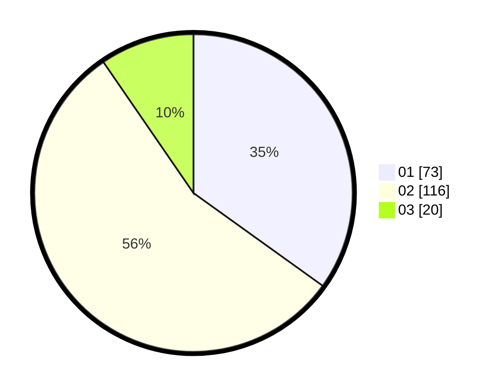

# Hasil

Hasil perolehan suara paslon dapat dilihat pada file paslon-01.txt, paslon-02.txt, dan paslon-03.txt.

Jika tidak ada, artinya data tersebut belum ada pada SIREKAP.

## Perolehan Suara

 * Paslon 01: **73**.
 * Paslon 02: **116**.
 * Paslon 03: **20**.

## Foto C Plano

https://sirekap-obj-formc.kpu.go.id/099c/pemilu/ppwp/31/75/05/10/05/3175051005027-20240214-230809--fa61f578-f521-4718-a5da-aac845d613c7.jpg

https://sirekap-obj-formc.kpu.go.id/099c/pemilu/ppwp/31/75/05/10/05/3175051005027-20240214-230943--90e79008-0f7a-43c3-8b0d-3113628f865d.jpg

https://sirekap-obj-formc.kpu.go.id/099c/pemilu/ppwp/31/75/05/10/05/3175051005027-20240214-231024--29f51190-ec50-4b11-9692-bc841b701955.jpg

## DATA PEMILIH TETAP

Jumlah pemilih dalam DPT: **270**.
 * L: **134**.
 * P: **136**.

## DATA PENGGUNA HAK PILIH

Jumlah pengguna hak pilih dalam DPT: **208**.
 * L: **98**.
 * P: **110**.

Jumlah pengguna hak pilih dalam DPTb: **0**.
 * L: **0**.
 * P: **0**.

Jumlah pengguna hak pilih dalam DPK: **5**.
 * L: **2**.
 * P: **3**.

Jumlah pengguna hak pilih: **213**.
 * L: **100**.
 * P: **113**.

## JUMLAH SUARA SAH DAN TIDAK SAH

JUMLAH SELURUH SUARA SAH: **209**.

JUMLAH SUARA TIDAK SAH: **4**.

JUMLAH SELURUH SUARA SAH DAN SUARA TIDAK SAH: **213**.
