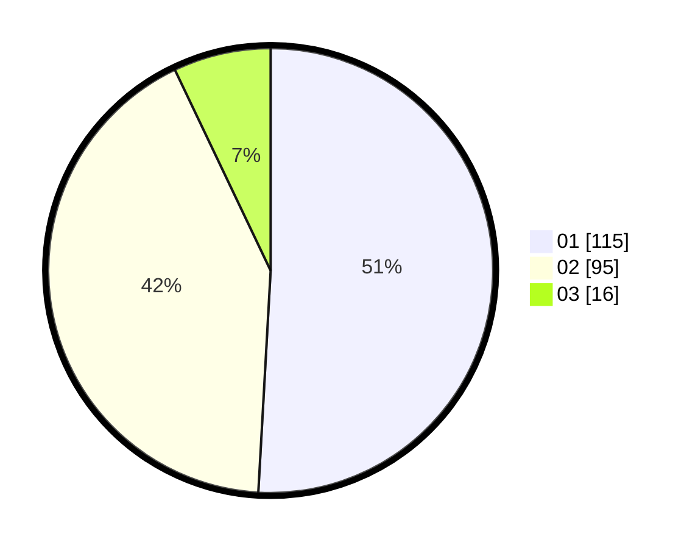

# Hasil

Hasil perolehan suara paslon dapat dilihat pada file paslon-01.txt, paslon-02.txt, dan paslon-03.txt.

Jika tidak ada, artinya data tersebut belum ada pada SIREKAP.

## Perolehan Suara

 * Paslon 01: **115**.
 * Paslon 02: **95**.
 * Paslon 03: **16**.

## Foto C Plano

https://sirekap-obj-formc.kpu.go.id/7c2a/pemilu/ppwp/31/75/05/10/05/3175051005033-20240214-162234--6eb6205d-e491-4616-be53-fca7e8874412.jpg

https://sirekap-obj-formc.kpu.go.id/7c2a/pemilu/ppwp/31/75/05/10/05/3175051005033-20240214-155455--56249765-ba47-46f0-9ab3-3b22a1dd61cd.jpg
