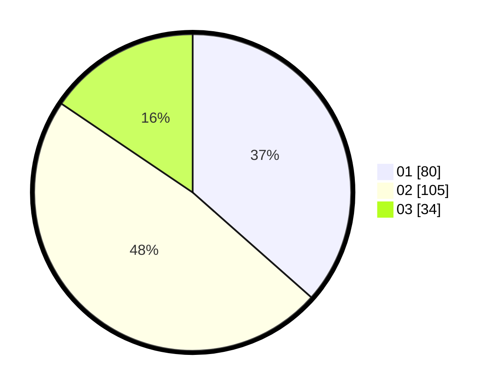

# Hasil

Hasil perolehan suara paslon dapat dilihat pada file paslon-01.txt, paslon-02.txt, dan paslon-03.txt.

Jika tidak ada, artinya data tersebut belum ada pada SIREKAP.

## Perolehan Suara

 * Paslon 01: **80**.
 * Paslon 02: **105**.
 * Paslon 03: **34**.

## Foto C Plano

https://sirekap-obj-formc.kpu.go.id/a145/pemilu/ppwp/31/75/05/10/05/3175051005034-20240214-160140--a44688c5-4cac-47e8-8ad7-fed23b431b64.jpg

https://sirekap-obj-formc.kpu.go.id/a145/pemilu/ppwp/31/75/05/10/05/3175051005034-20240215-003744--36839cb6-da99-41b0-b0fa-6a2777e57d4f.jpg

https://sirekap-obj-formc.kpu.go.id/a145/pemilu/ppwp/31/75/05/10/05/3175051005034-20240216-131637--c9fc5164-224d-434f-a040-57918cb2a83b.jpg

## DATA PEMILIH TETAP

Jumlah pemilih dalam DPT: **258**.
 * L: **130**.
 * P: **128**.

## DATA PENGGUNA HAK PILIH

Jumlah pengguna hak pilih dalam DPT: **222**.
 * L: **105**.
 * P: **117**.

Jumlah pengguna hak pilih dalam DPTb: **0**.
 * L: **0**.
 * P: **0**.

Jumlah pengguna hak pilih dalam DPK: **2**.
 * L: **2**.
 * P: **0**.

Jumlah pengguna hak pilih: **224**.
 * L: **107**.
 * P: **117**.

## JUMLAH SUARA SAH DAN TIDAK SAH

JUMLAH SELURUH SUARA SAH: **219**.

JUMLAH SUARA TIDAK SAH: **5**.

JUMLAH SELURUH SUARA SAH DAN SUARA TIDAK SAH: **224**.
