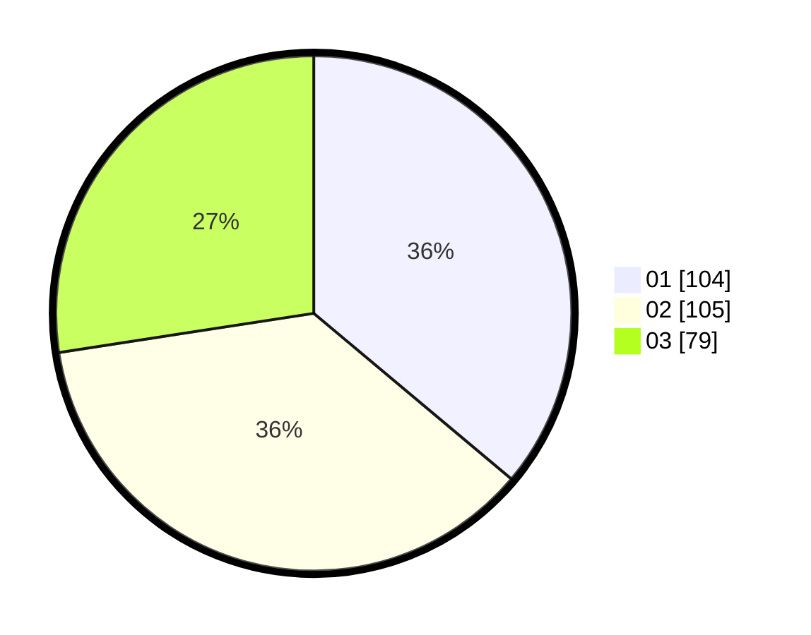

# Hasil

Hasil perolehan suara paslon dapat dilihat pada file paslon-01.txt, paslon-02.txt, dan paslon-03.txt.

Jika tidak ada, artinya data tersebut belum ada pada SIREKAP.

## Perolehan Suara

 * Paslon 01: **104**.
 * Paslon 02: **105**.
 * Paslon 03: **79**.

## Foto C Plano

https://sirekap-obj-formc.kpu.go.id/354e/pemilu/ppwp/31/75/05/10/05/3175051005043-20240214-201228--0e6f5d7a-7081-463d-932d-1a022440bb24.jpg

https://sirekap-obj-formc.kpu.go.id/354e/pemilu/ppwp/31/75/05/10/05/3175051005043-20240214-203653--0b115356-6b4b-4e80-8d1f-b5a615b59a3c.jpg

https://sirekap-obj-formc.kpu.go.id/354e/pemilu/ppwp/31/75/05/10/05/3175051005043-20240214-230105--36821146-430b-4afb-a51c-21239c48688d.jpg
