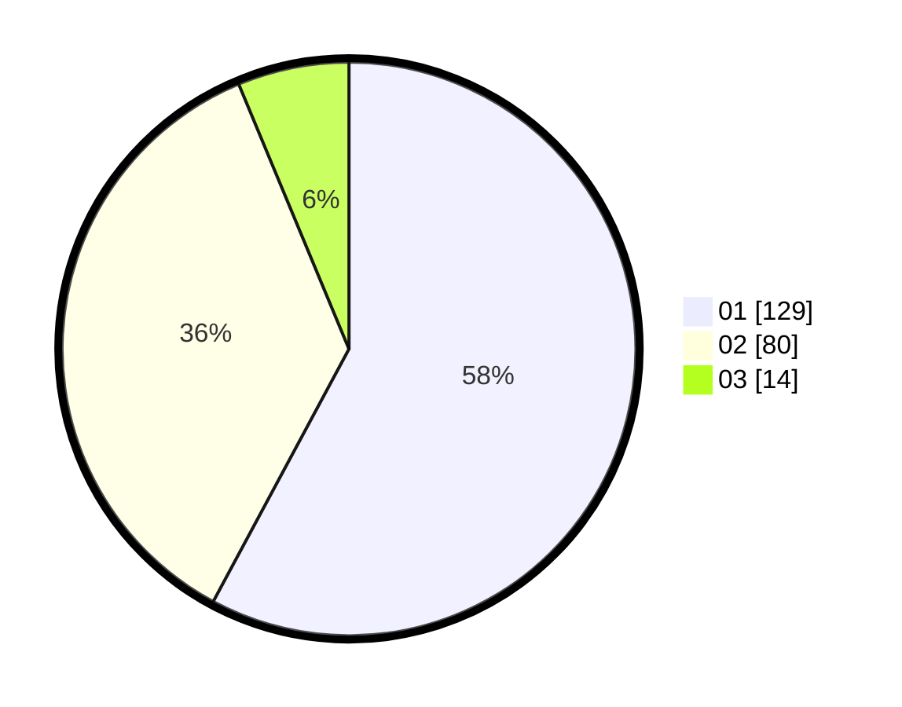

# Hasil

Hasil perolehan suara paslon dapat dilihat pada file paslon-01.txt, paslon-02.txt, dan paslon-03.txt.

Jika tidak ada, artinya data tersebut belum ada pada SIREKAP.

## Perolehan Suara

 * Paslon 01: **129**.
 * Paslon 02: **80**.
 * Paslon 03: **14**.

## Foto C Plano

https://sirekap-obj-formc.kpu.go.id/f438/pemilu/ppwp/31/75/05/10/05/3175051005053-20240214-155222--8f2062c2-545e-4b8c-a68a-f73fa72789cf.jpg

https://sirekap-obj-formc.kpu.go.id/f438/pemilu/ppwp/31/75/05/10/05/3175051005053-20240214-200451--ba70ce7b-67d7-4a7d-b54e-150c13d60df6.jpg

https://sirekap-obj-formc.kpu.go.id/f438/pemilu/ppwp/31/75/05/10/05/3175051005053-20240214-200701--f0ea5c14-bcd3-41a7-8930-079f2d05f7bd.jpg

## DATA PEMILIH TETAP

Jumlah pemilih dalam DPT: **295**.
 * L: **148**.
 * P: **147**.

## DATA PENGGUNA HAK PILIH

Jumlah pengguna hak pilih dalam DPT: **225**.
 * L: **103**.
 * P: **122**.

Jumlah pengguna hak pilih dalam DPTb: **0**.
 * L: **0**.
 * P: **0**.

Jumlah pengguna hak pilih dalam DPK: **2**.
 * L: **2**.
 * P: **0**.

Jumlah pengguna hak pilih: **227**.
 * L: **105**.
 * P: **122**.

## JUMLAH SUARA SAH DAN TIDAK SAH

JUMLAH SELURUH SUARA SAH: **223**.

JUMLAH SUARA TIDAK SAH: **4**.

JUMLAH SELURUH SUARA SAH DAN SUARA TIDAK SAH: **227**.
