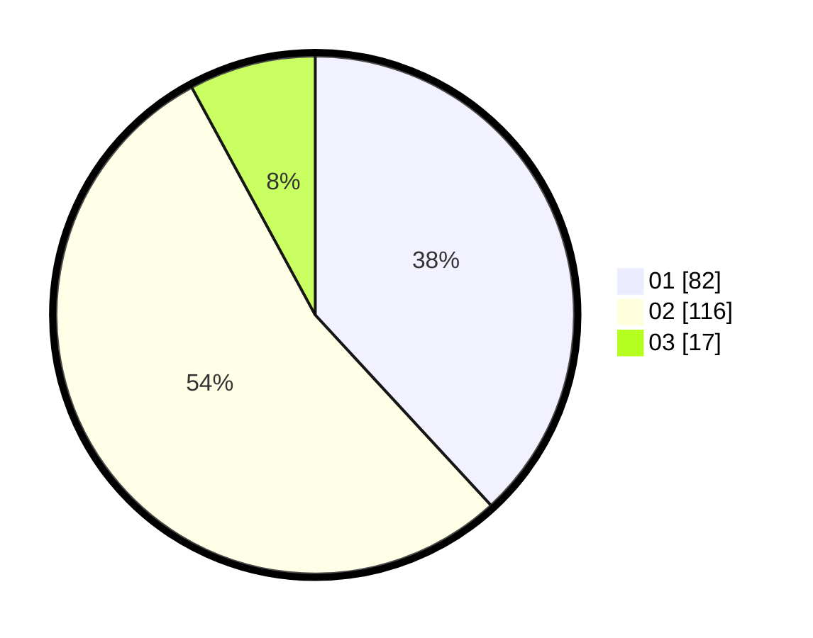

# Hasil

Hasil perolehan suara paslon dapat dilihat pada file paslon-01.txt, paslon-02.txt, dan paslon-03.txt.

Jika tidak ada, artinya data tersebut belum ada pada SIREKAP.

## Perolehan Suara

 * Paslon 01: **82**.
 * Paslon 02: **116**.
 * Paslon 03: **17**.

## Foto C Plano

https://sirekap-obj-formc.kpu.go.id/d217/pemilu/ppwp/31/75/05/10/05/3175051005060-20240214-191347--b6efe791-3da2-46e9-8eca-cb34ce4edfe8.jpg

https://sirekap-obj-formc.kpu.go.id/d217/pemilu/ppwp/31/75/05/10/05/3175051005060-20240214-191350--383834e0-5df6-49d0-9bc9-42f579f2c53d.jpg

https://sirekap-obj-formc.kpu.go.id/d217/pemilu/ppwp/31/75/05/10/05/3175051005060-20240214-191354--ca081276-20c9-41e4-92f2-355ce0870e77.jpg

## DATA PEMILIH TETAP

Jumlah pemilih dalam DPT: **278**.
 * L: **137**.
 * P: **141**.

## DATA PENGGUNA HAK PILIH

Jumlah pengguna hak pilih dalam DPT: **217**.
 * L: **100**.
 * P: **117**.

Jumlah pengguna hak pilih dalam DPTb: **0**.
 * L: **0**.
 * P: **0**.

Jumlah pengguna hak pilih dalam DPK: **0**.
 * L: **0**.
 * P: **0**.

Jumlah pengguna hak pilih: **217**.
 * L: **100**.
 * P: **117**.

## JUMLAH SUARA SAH DAN TIDAK SAH

JUMLAH SELURUH SUARA SAH: **215**.

JUMLAH SUARA TIDAK SAH: **2**.

JUMLAH SELURUH SUARA SAH DAN SUARA TIDAK SAH: **217**.
