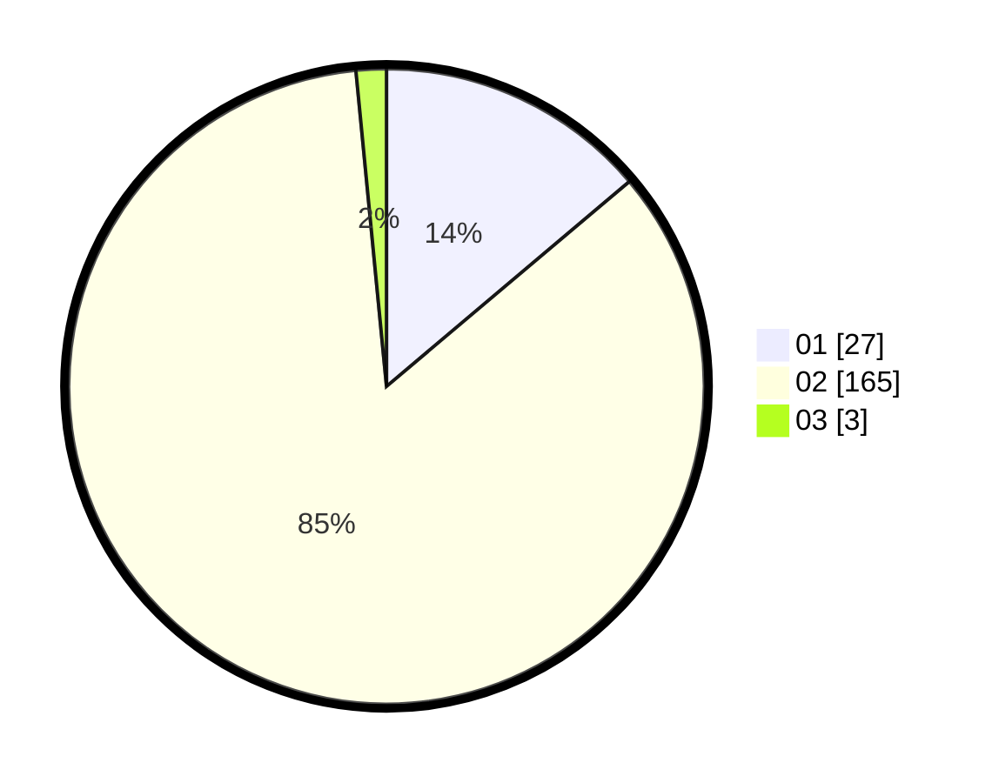

# Hasil

Hasil perolehan suara paslon dapat dilihat pada file paslon-01.txt, paslon-02.txt, dan paslon-03.txt.

Jika tidak ada, artinya data tersebut belum ada pada SIREKAP.

## Perolehan Suara

 * Paslon 01: **27**.
 * Paslon 02: **165**.
 * Paslon 03: **3**.

## Foto C Plano

https://sirekap-obj-formc.kpu.go.id/f29a/pemilu/ppwp/31/75/05/10/05/3175051005062-20240214-201002--89d39c32-5963-4f24-88e9-0c7972108cbb.jpg

https://sirekap-obj-formc.kpu.go.id/f29a/pemilu/ppwp/31/75/05/10/05/3175051005062-20240214-201037--72d40722-f7b4-4a54-b6f7-8a6ee2973433.jpg

https://sirekap-obj-formc.kpu.go.id/f29a/pemilu/ppwp/31/75/05/10/05/3175051005062-20240214-201119--c76a06f0-528c-4167-a7ec-a8981d22f940.jpg

## DATA PEMILIH TETAP

Jumlah pemilih dalam DPT: **292**.
 * L: **77**.
 * P: **215**.

## DATA PENGGUNA HAK PILIH

Jumlah pengguna hak pilih dalam DPT: **179**.
 * L: **34**.
 * P: **145**.

Jumlah pengguna hak pilih dalam DPTb: **11**.
 * L: **11**.
 * P: **0**.

Jumlah pengguna hak pilih dalam DPK: **6**.
 * L: **0**.
 * P: **6**.

Jumlah pengguna hak pilih: **196**.
 * L: **45**.
 * P: **151**.

## JUMLAH SUARA SAH DAN TIDAK SAH

JUMLAH SELURUH SUARA SAH: **195**.

JUMLAH SUARA TIDAK SAH: **1**.

JUMLAH SELURUH SUARA SAH DAN SUARA TIDAK SAH: **196**.
