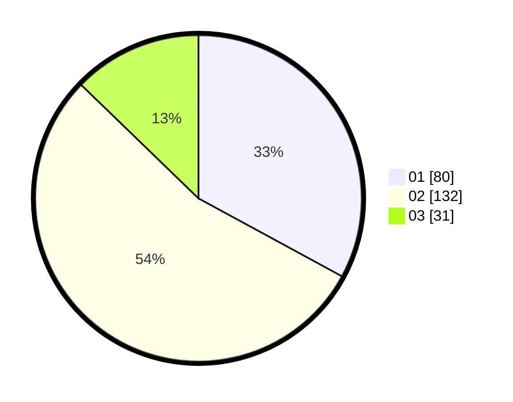

# Hasil

Hasil perolehan suara paslon dapat dilihat pada file paslon-01.txt, paslon-02.txt, dan paslon-03.txt.

Jika tidak ada, artinya data tersebut belum ada pada SIREKAP.

## Perolehan Suara

 * Paslon 01: **80**.
 * Paslon 02: **132**.
 * Paslon 03: **31**.

## Foto C Plano

https://sirekap-obj-formc.kpu.go.id/45c9/pemilu/ppwp/31/75/05/10/05/3175051005065-20240215-025951--6f28ada2-75e2-495e-bbf8-3441456c4e42.jpg

https://sirekap-obj-formc.kpu.go.id/45c9/pemilu/ppwp/31/75/05/10/05/3175051005065-20240215-030102--ec2c36c1-ae5f-4b2f-a57c-a9e39fe393ce.jpg

https://sirekap-obj-formc.kpu.go.id/45c9/pemilu/ppwp/31/75/05/10/05/3175051005065-20240215-030200--bd5adae2-2a7b-45ee-bf7f-db8a31614124.jpg
