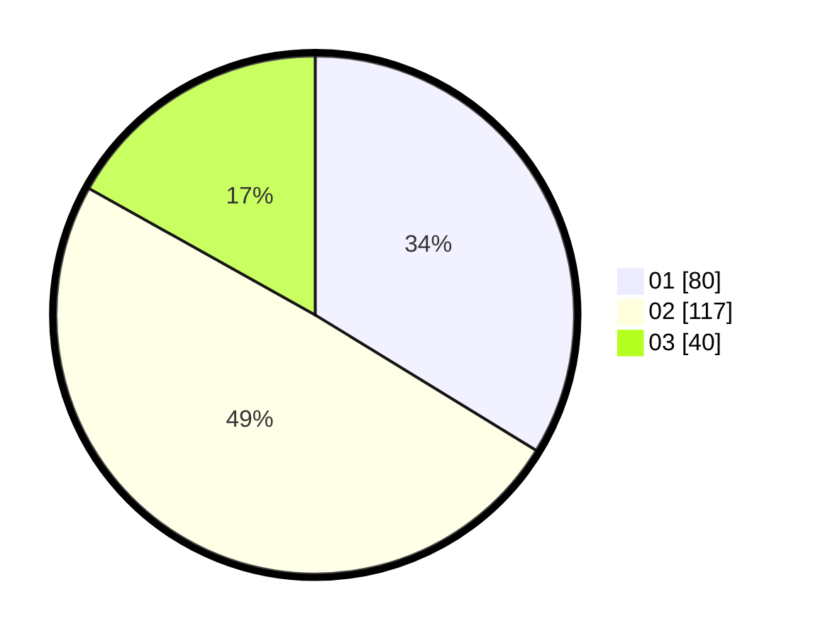

# Hasil

Hasil perolehan suara paslon dapat dilihat pada file paslon-01.txt, paslon-02.txt, dan paslon-03.txt.

Jika tidak ada, artinya data tersebut belum ada pada SIREKAP.

## Perolehan Suara

 * Paslon 01: **80**.
 * Paslon 02: **117**.
 * Paslon 03: **40**.

## Foto C Plano

https://sirekap-obj-formc.kpu.go.id/6eba/pemilu/ppwp/31/75/05/10/05/3175051005069-20240214-191840--3b87ec8d-114b-4e23-bdff-b5badf78bf2e.jpg

https://sirekap-obj-formc.kpu.go.id/6eba/pemilu/ppwp/31/75/05/10/05/3175051005069-20240214-160133--2f88feaa-bfd0-403e-96a4-b8e0dd7f49e0.jpg

https://sirekap-obj-formc.kpu.go.id/6eba/pemilu/ppwp/31/75/05/10/05/3175051005069-20240214-192013--98057c42-eefb-4827-a29a-6a1b7b90b3d8.jpg
