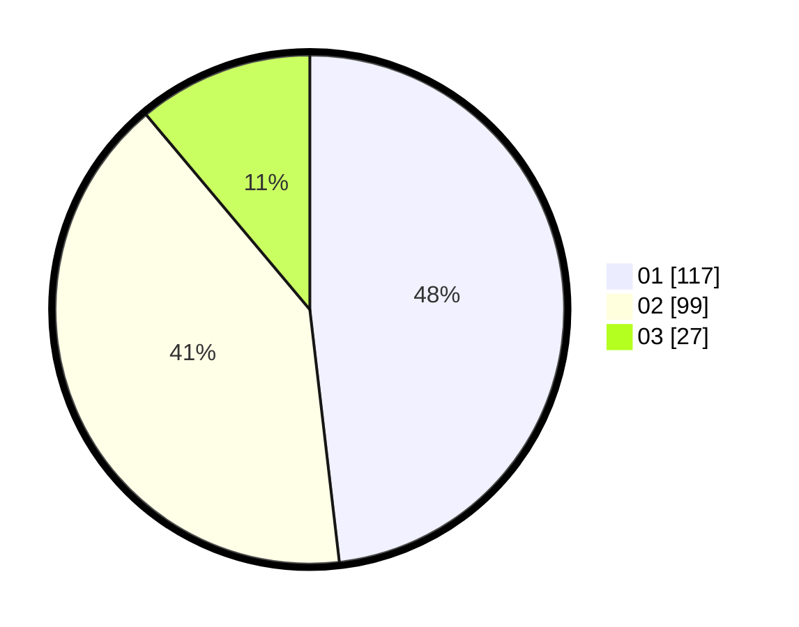

# Hasil

Hasil perolehan suara paslon dapat dilihat pada file paslon-01.txt, paslon-02.txt, dan paslon-03.txt.

Jika tidak ada, artinya data tersebut belum ada pada SIREKAP.

## Perolehan Suara

 * Paslon 01: **117**.
 * Paslon 02: **99**.
 * Paslon 03: **27**.

## Foto C Plano

https://sirekap-obj-formc.kpu.go.id/6850/pemilu/ppwp/31/75/05/10/05/3175051005080-20240214-204352--47ca2a2d-1854-432c-baf4-8943ab1eb7ed.jpg

https://sirekap-obj-formc.kpu.go.id/6850/pemilu/ppwp/31/75/05/10/05/3175051005080-20240214-204450--9f1e7899-1e7c-443a-9f35-cc7e72ad1dce.jpg

https://sirekap-obj-formc.kpu.go.id/6850/pemilu/ppwp/31/75/05/10/05/3175051005080-20240214-204557--6215330d-8706-4a32-b604-dd0b4829954a.jpg

## DATA PEMILIH TETAP

Jumlah pemilih dalam DPT: **290**.
 * L: **149**.
 * P: **141**.

## DATA PENGGUNA HAK PILIH

Jumlah pengguna hak pilih dalam DPT: **290**.
 * L: **149**.
 * P: **141**.

Jumlah pengguna hak pilih dalam DPTb: **0**.
 * L: **0**.
 * P: **0**.

Jumlah pengguna hak pilih dalam DPK: **0**.
 * L: **0**.
 * P: **0**.

Jumlah pengguna hak pilih: **290**.
 * L: **149**.
 * P: **141**.

## JUMLAH SUARA SAH DAN TIDAK SAH

JUMLAH SELURUH SUARA SAH: **243**.

JUMLAH SUARA TIDAK SAH: **5**.

JUMLAH SELURUH SUARA SAH DAN SUARA TIDAK SAH: **248**.
