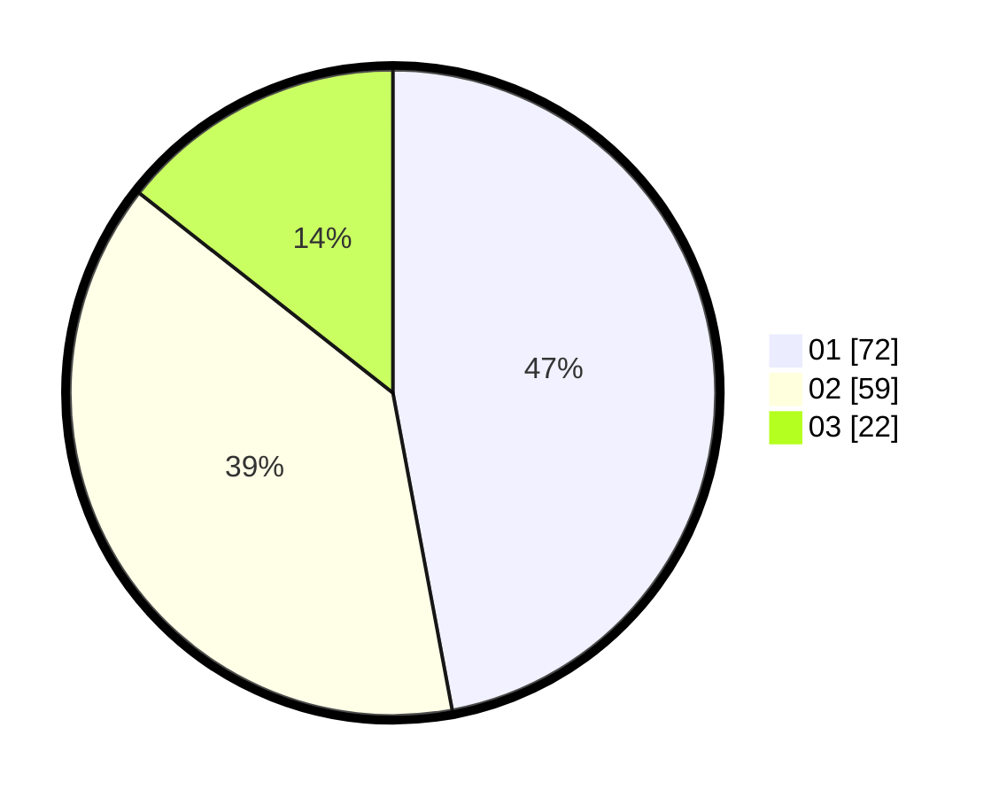

# Hasil

Hasil perolehan suara paslon dapat dilihat pada file paslon-01.txt, paslon-02.txt, dan paslon-03.txt.

Jika tidak ada, artinya data tersebut belum ada pada SIREKAP.

## Perolehan Suara

 * Paslon 01: **72**.
 * Paslon 02: **59**.
 * Paslon 03: **22**.

## Foto C Plano

https://sirekap-obj-formc.kpu.go.id/84ca/pemilu/ppwp/31/75/05/10/05/3175051005082-20240214-220334--c9e78af7-302d-4283-8cad-9523f90ee4ec.jpg

https://sirekap-obj-formc.kpu.go.id/84ca/pemilu/ppwp/31/75/05/10/05/3175051005082-20240214-220442--a8154f6f-dd7c-49b2-9cc1-6b979023b045.jpg

https://sirekap-obj-formc.kpu.go.id/84ca/pemilu/ppwp/31/75/05/10/05/3175051005082-20240214-220540--697449a4-6964-4d11-b02f-f5c4a65394a4.jpg

## DATA PEMILIH TETAP

Jumlah pemilih dalam DPT: **190**.
 * L: **99**.
 * P: **91**.

## DATA PENGGUNA HAK PILIH

Jumlah pengguna hak pilih dalam DPT: **149**.
 * L: **71**.
 * P: **78**.

Jumlah pengguna hak pilih dalam DPTb: **8**.
 * L: **2**.
 * P: **6**.

Jumlah pengguna hak pilih dalam DPK: **1**.
 * L: **1**.
 * P: **0**.

Jumlah pengguna hak pilih: **158**.
 * L: **74**.
 * P: **84**.

## JUMLAH SUARA SAH DAN TIDAK SAH

JUMLAH SELURUH SUARA SAH: **153**.

JUMLAH SUARA TIDAK SAH: **5**.

JUMLAH SELURUH SUARA SAH DAN SUARA TIDAK SAH: **158**.
