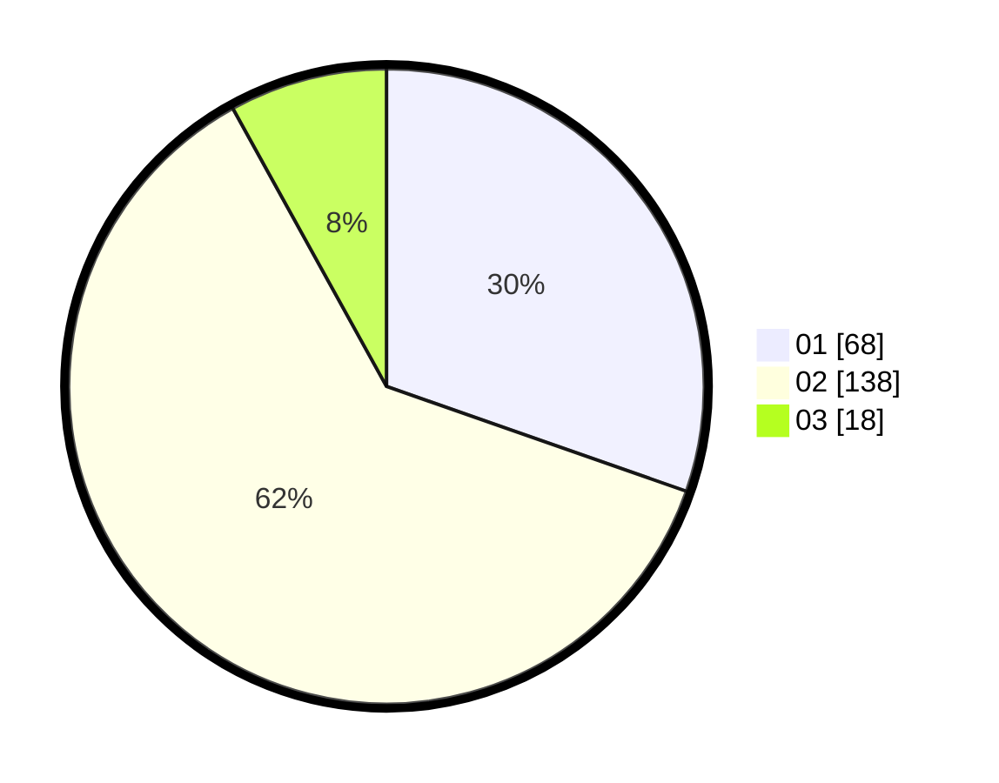

# Hasil

Hasil perolehan suara paslon dapat dilihat pada file paslon-01.txt, paslon-02.txt, dan paslon-03.txt.

Jika tidak ada, artinya data tersebut belum ada pada SIREKAP.

## Perolehan Suara

 * Paslon 01: **68**.
 * Paslon 02: **138**.
 * Paslon 03: **18**.

## Foto C Plano

https://sirekap-obj-formc.kpu.go.id/1045/pemilu/ppwp/31/75/05/10/05/3175051005086-20240215-010203--292f4adf-1bc1-4243-847e-cd281194e2e1.jpg

https://sirekap-obj-formc.kpu.go.id/1045/pemilu/ppwp/31/75/05/10/05/3175051005086-20240215-010247--00efb1b0-4f42-42ee-bcaa-4054a406563f.jpg

https://sirekap-obj-formc.kpu.go.id/1045/pemilu/ppwp/31/75/05/10/05/3175051005086-20240215-010330--78428fc4-69b2-47a5-99f5-3d9d17ba32b9.jpg

## DATA PEMILIH TETAP

Jumlah pemilih dalam DPT: **296**.
 * L: **120**.
 * P: **176**.

## DATA PENGGUNA HAK PILIH

Jumlah pengguna hak pilih dalam DPT: **221**.
 * L: **82**.
 * P: **139**.

Jumlah pengguna hak pilih dalam DPTb: **0**.
 * L: **0**.
 * P: **0**.

Jumlah pengguna hak pilih dalam DPK: **9**.
 * L: **6**.
 * P: **3**.

Jumlah pengguna hak pilih: **230**.
 * L: **88**.
 * P: **142**.

## JUMLAH SUARA SAH DAN TIDAK SAH

JUMLAH SELURUH SUARA SAH: **224**.

JUMLAH SUARA TIDAK SAH: **6**.

JUMLAH SELURUH SUARA SAH DAN SUARA TIDAK SAH: **230**.
