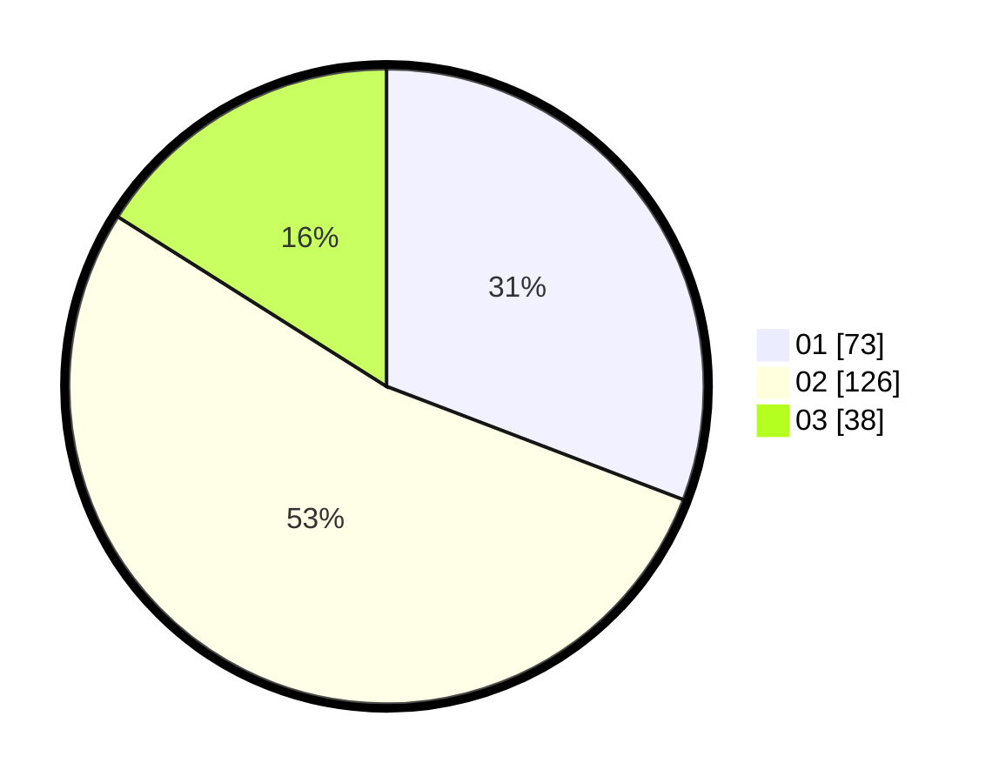

# Hasil

Hasil perolehan suara paslon dapat dilihat pada file paslon-01.txt, paslon-02.txt, dan paslon-03.txt.

Jika tidak ada, artinya data tersebut belum ada pada SIREKAP.

## Perolehan Suara

 * Paslon 01: **73**.
 * Paslon 02: **126**.
 * Paslon 03: **38**.

## Foto C Plano

https://sirekap-obj-formc.kpu.go.id/49f7/pemilu/ppwp/31/75/05/10/05/3175051005088-20240214-205909--4031d347-447c-47bb-b9fc-e2507c418cde.jpg

https://sirekap-obj-formc.kpu.go.id/49f7/pemilu/ppwp/31/75/05/10/05/3175051005088-20240214-210351--b37fe3ca-b309-4c2c-a8a0-2e91402011aa.jpg

https://sirekap-obj-formc.kpu.go.id/49f7/pemilu/ppwp/31/75/05/10/05/3175051005088-20240214-210148--fe476a4d-6a06-4d7c-85bc-ddb2ecade140.jpg
