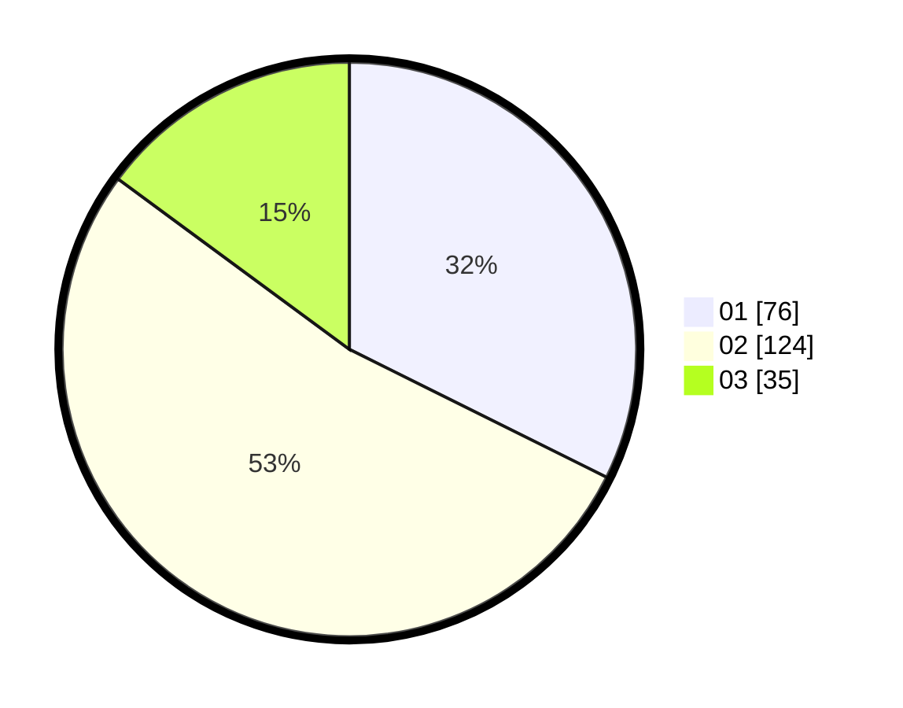

# Hasil

Hasil perolehan suara paslon dapat dilihat pada file paslon-01.txt, paslon-02.txt, dan paslon-03.txt.

Jika tidak ada, artinya data tersebut belum ada pada SIREKAP.

## Perolehan Suara

 * Paslon 01: **76**.
 * Paslon 02: **124**.
 * Paslon 03: **35**.

## Foto C Plano

https://sirekap-obj-formc.kpu.go.id/583b/pemilu/ppwp/31/75/05/10/05/3175051005094-20240214-235437--bb94a22a-d51d-4559-b9ed-fef5ab122408.jpg

https://sirekap-obj-formc.kpu.go.id/583b/pemilu/ppwp/31/75/05/10/05/3175051005094-20240214-235626--0fa130b1-283e-4c33-a7d0-e1fab504ddb3.jpg

https://sirekap-obj-formc.kpu.go.id/583b/pemilu/ppwp/31/75/05/10/05/3175051005094-20240214-235855--8a334962-7dab-4d60-ac59-ad78512cc7c5.jpg
