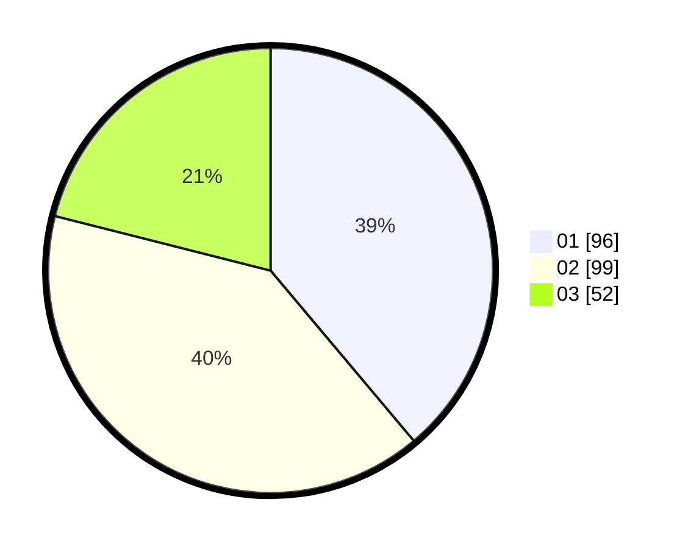

# Hasil

Hasil perolehan suara paslon dapat dilihat pada file paslon-01.txt, paslon-02.txt, dan paslon-03.txt.

Jika tidak ada, artinya data tersebut belum ada pada SIREKAP.

## Perolehan Suara

 * Paslon 01: **96**.
 * Paslon 02: **99**.
 * Paslon 03: **52**.

## Foto C Plano

https://sirekap-obj-formc.kpu.go.id/f11a/pemilu/ppwp/31/75/05/10/05/3175051005097-20240214-155157--6c5e0326-b071-4184-b36f-9373798ed7c1.jpg

https://sirekap-obj-formc.kpu.go.id/f11a/pemilu/ppwp/31/75/05/10/05/3175051005097-20240214-155400--b0044cde-4fcd-47e2-8dec-3150d6aebf37.jpg

https://sirekap-obj-formc.kpu.go.id/f11a/pemilu/ppwp/31/75/05/10/05/3175051005097-20240214-155821--503da688-1d44-488b-98ae-ed253228079c.jpg
