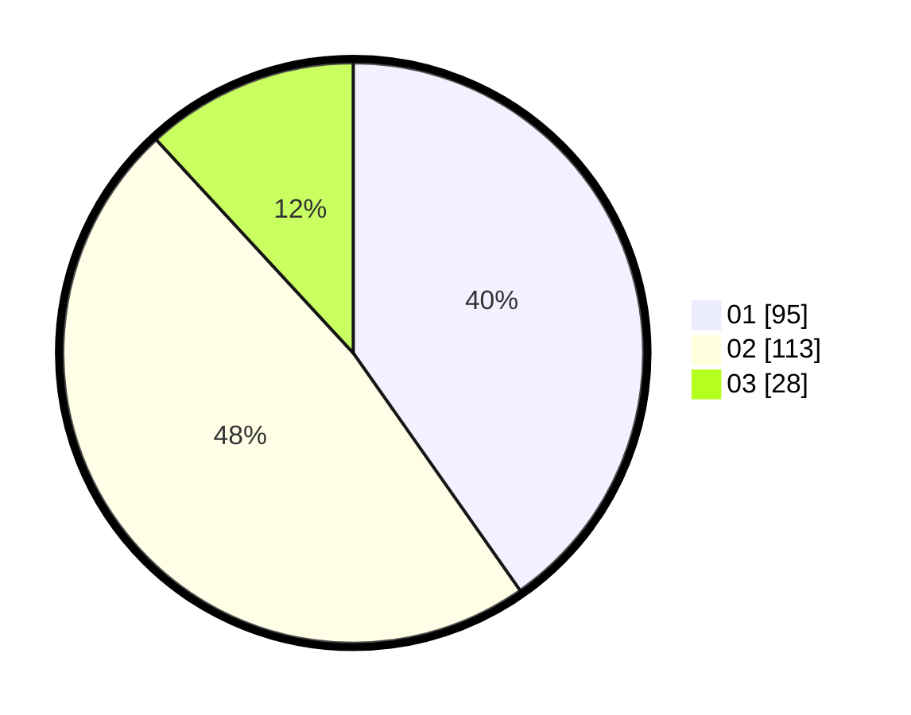

# Hasil

Hasil perolehan suara paslon dapat dilihat pada file paslon-01.txt, paslon-02.txt, dan paslon-03.txt.

Jika tidak ada, artinya data tersebut belum ada pada SIREKAP.

## Perolehan Suara

 * Paslon 01: **95**.
 * Paslon 02: **113**.
 * Paslon 03: **28**.

## Foto C Plano

https://sirekap-obj-formc.kpu.go.id/faf0/pemilu/ppwp/31/75/05/10/05/3175051005103-20240214-190613--972a12b8-0bd9-4385-b151-02f9306d215b.jpg

https://sirekap-obj-formc.kpu.go.id/faf0/pemilu/ppwp/31/75/05/10/05/3175051005103-20240214-190618--af21934a-065b-4af2-83f5-cfa8e6ba299e.jpg

https://sirekap-obj-formc.kpu.go.id/faf0/pemilu/ppwp/31/75/05/10/05/3175051005103-20240214-190623--a52628bc-7539-4119-9cd4-a637582e30a6.jpg

## DATA PEMILIH TETAP

Jumlah pemilih dalam DPT: **283**.
 * L: **139**.
 * P: **144**.

## DATA PENGGUNA HAK PILIH

Jumlah pengguna hak pilih dalam DPT: **236**.
 * L: **115**.
 * P: **121**.

Jumlah pengguna hak pilih dalam DPTb: **0**.
 * L: **0**.
 * P: **0**.

Jumlah pengguna hak pilih dalam DPK: **2**.
 * L: **0**.
 * P: **2**.

Jumlah pengguna hak pilih: **238**.
 * L: **115**.
 * P: **123**.

## JUMLAH SUARA SAH DAN TIDAK SAH

JUMLAH SELURUH SUARA SAH: **236**.

JUMLAH SUARA TIDAK SAH: **2**.

JUMLAH SELURUH SUARA SAH DAN SUARA TIDAK SAH: **238**.
