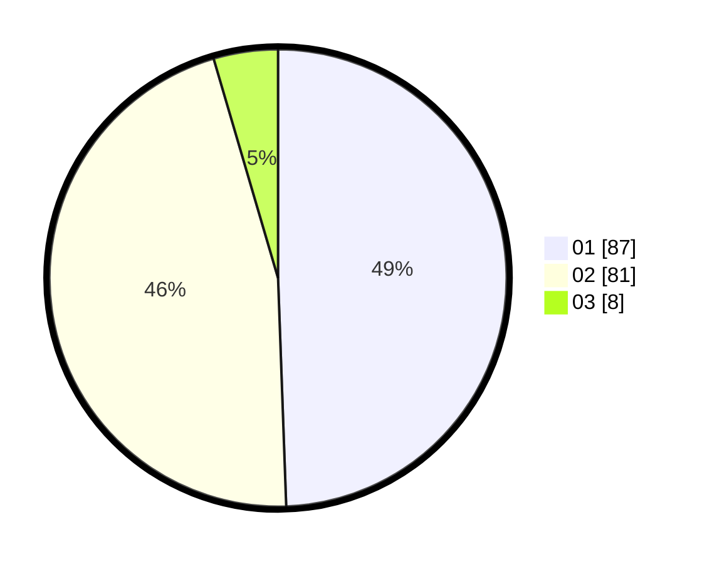

# Hasil

Hasil perolehan suara paslon dapat dilihat pada file paslon-01.txt, paslon-02.txt, dan paslon-03.txt.

Jika tidak ada, artinya data tersebut belum ada pada SIREKAP.

## Perolehan Suara

 * Paslon 01: **87**.
 * Paslon 02: **81**.
 * Paslon 03: **8**.

## Foto C Plano

https://sirekap-obj-formc.kpu.go.id/d75e/pemilu/ppwp/31/75/05/10/05/3175051005112-20240215-213205--2b7fac53-af2d-4b51-9b86-e3fc0be93ba9.jpg

https://sirekap-obj-formc.kpu.go.id/d75e/pemilu/ppwp/31/75/05/10/05/3175051005112-20240216-163735--14de7888-c05e-49c7-a6a7-66d5b8527a8f.jpg

https://sirekap-obj-formc.kpu.go.id/d75e/pemilu/ppwp/31/75/05/10/05/3175051005112-20240214-211708--872a193e-d9b6-46b0-89b0-9dc135177faf.jpg

## DATA PEMILIH TETAP

Jumlah pemilih dalam DPT: **229**.
 * L: **108**.
 * P: **121**.

## DATA PENGGUNA HAK PILIH

Jumlah pengguna hak pilih dalam DPT: **177**.
 * L: **83**.
 * P: **94**.

Jumlah pengguna hak pilih dalam DPTb: **0**.
 * L: **0**.
 * P: **0**.

Jumlah pengguna hak pilih dalam DPK: **1**.
 * L: **1**.
 * P: **0**.

Jumlah pengguna hak pilih: **178**.
 * L: **84**.
 * P: **94**.

## JUMLAH SUARA SAH DAN TIDAK SAH

JUMLAH SELURUH SUARA SAH: **176**.

JUMLAH SUARA TIDAK SAH: **2**.

JUMLAH SELURUH SUARA SAH DAN SUARA TIDAK SAH: **178**.
