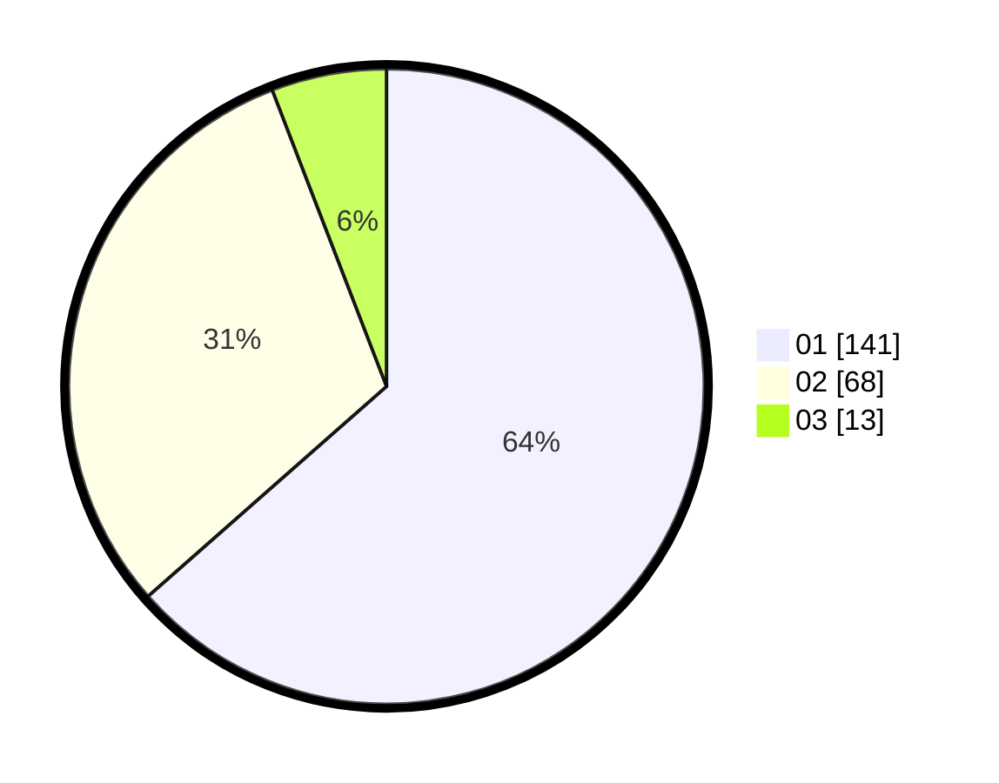

# Hasil

Hasil perolehan suara paslon dapat dilihat pada file paslon-01.txt, paslon-02.txt, dan paslon-03.txt.

Jika tidak ada, artinya data tersebut belum ada pada SIREKAP.

## Perolehan Suara

 * Paslon 01: **141**.
 * Paslon 02: **68**.
 * Paslon 03: **13**.

## Foto C Plano

https://sirekap-obj-formc.kpu.go.id/a115/pemilu/ppwp/31/75/05/10/05/3175051005113-20240214-211657--732bf02e-9ee3-4ce6-8571-03871a6f6d4b.jpg

https://sirekap-obj-formc.kpu.go.id/a115/pemilu/ppwp/31/75/05/10/05/3175051005113-20240214-211858--18b16182-183e-4f6c-8441-33eab0e7c08c.jpg

https://sirekap-obj-formc.kpu.go.id/a115/pemilu/ppwp/31/75/05/10/05/3175051005113-20240214-212029--088d4cc7-b160-4dee-a494-acd58a0b33d6.jpg

## DATA PEMILIH TETAP

Jumlah pemilih dalam DPT: **273**.
 * L: **146**.
 * P: **127**.

## DATA PENGGUNA HAK PILIH

Jumlah pengguna hak pilih dalam DPT: **227**.
 * L: **121**.
 * P: **106**.

Jumlah pengguna hak pilih dalam DPTb: **0**.
 * L: **0**.
 * P: **0**.

Jumlah pengguna hak pilih dalam DPK: **2**.
 * L: **1**.
 * P: **1**.

Jumlah pengguna hak pilih: **229**.
 * L: **122**.
 * P: **107**.

## JUMLAH SUARA SAH DAN TIDAK SAH

JUMLAH SELURUH SUARA SAH: **222**.

JUMLAH SUARA TIDAK SAH: **7**.

JUMLAH SELURUH SUARA SAH DAN SUARA TIDAK SAH: **229**.
