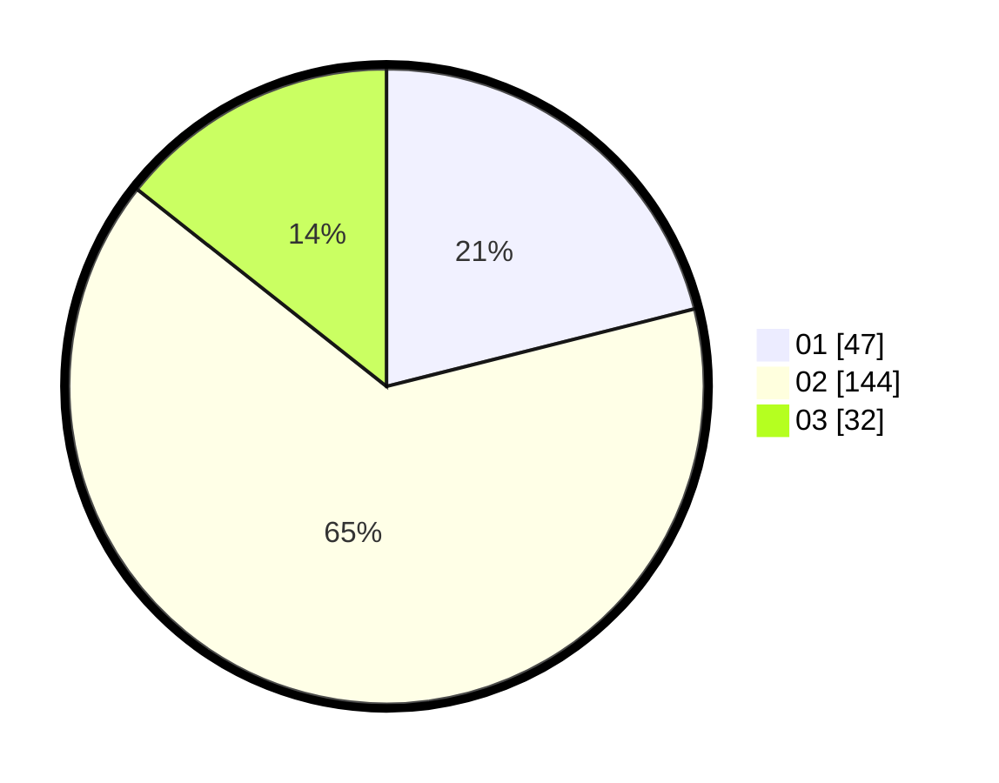

# Hasil

Hasil perolehan suara paslon dapat dilihat pada file paslon-01.txt, paslon-02.txt, dan paslon-03.txt.

Jika tidak ada, artinya data tersebut belum ada pada SIREKAP.

## Perolehan Suara

 * Paslon 01: **47**.
 * Paslon 02: **144**.
 * Paslon 03: **32**.

## Foto C Plano

https://sirekap-obj-formc.kpu.go.id/91ac/pemilu/ppwp/31/75/05/10/05/3175051005128-20240215-010102--9527c645-95ab-459c-a0e9-f6fad12253b4.jpg

https://sirekap-obj-formc.kpu.go.id/91ac/pemilu/ppwp/31/75/05/10/05/3175051005128-20240215-010245--71ec4216-e04f-44a0-92a6-7f626dbfcad9.jpg

https://sirekap-obj-formc.kpu.go.id/91ac/pemilu/ppwp/31/75/05/10/05/3175051005128-20240215-010353--547754d7-6a73-42df-8c1b-7cdf391e5fed.jpg

## DATA PEMILIH TETAP

Jumlah pemilih dalam DPT: **270**.
 * L: **127**.
 * P: **143**.

## DATA PENGGUNA HAK PILIH

Jumlah pengguna hak pilih dalam DPT: **225**.
 * L: **103**.
 * P: **122**.

Jumlah pengguna hak pilih dalam DPTb: **0**.
 * L: **0**.
 * P: **0**.

Jumlah pengguna hak pilih dalam DPK: **2**.
 * L: **1**.
 * P: **1**.

Jumlah pengguna hak pilih: **227**.
 * L: **104**.
 * P: **123**.

## JUMLAH SUARA SAH DAN TIDAK SAH

JUMLAH SELURUH SUARA SAH: **223**.

JUMLAH SUARA TIDAK SAH: **4**.

JUMLAH SELURUH SUARA SAH DAN SUARA TIDAK SAH: **227**.
