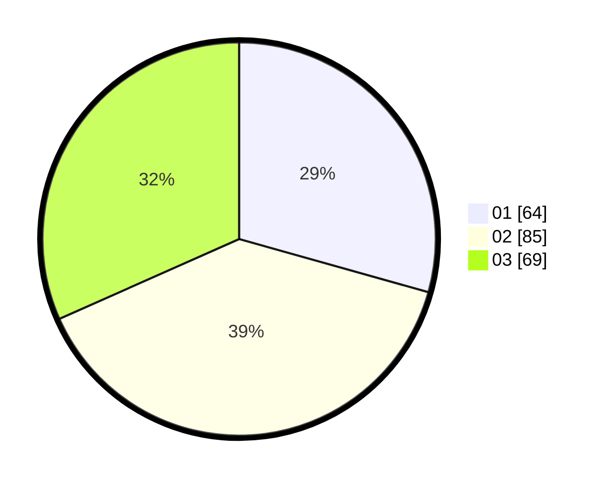

# Hasil

Hasil perolehan suara paslon dapat dilihat pada file paslon-01.txt, paslon-02.txt, dan paslon-03.txt.

Jika tidak ada, artinya data tersebut belum ada pada SIREKAP.

## Perolehan Suara

 * Paslon 01: **64**.
 * Paslon 02: **85**.
 * Paslon 03: **69**.

## Foto C Plano

https://sirekap-obj-formc.kpu.go.id/2fe7/pemilu/ppwp/31/75/05/10/05/3175051005130-20240214-193048--69b84aa4-8eb1-47c5-bc35-962523152c53.jpg

https://sirekap-obj-formc.kpu.go.id/2fe7/pemilu/ppwp/31/75/05/10/05/3175051005130-20240214-214642--9eb87e7e-85f8-40ff-a8a3-f1d620f14e28.jpg

https://sirekap-obj-formc.kpu.go.id/2fe7/pemilu/ppwp/31/75/05/10/05/3175051005130-20240214-194031--68cd79c3-7f8a-455b-a10d-3a216d17811f.jpg

## DATA PEMILIH TETAP

Jumlah pemilih dalam DPT: **269**.
 * L: **130**.
 * P: **139**.

## DATA PENGGUNA HAK PILIH

Jumlah pengguna hak pilih dalam DPT: **219**.
 * L: **105**.
 * P: **114**.

Jumlah pengguna hak pilih dalam DPTb: **1**.
 * L: **0**.
 * P: **1**.

Jumlah pengguna hak pilih dalam DPK: **0**.
 * L: **0**.
 * P: **0**.

Jumlah pengguna hak pilih: **220**.
 * L: **105**.
 * P: **115**.

## JUMLAH SUARA SAH DAN TIDAK SAH

JUMLAH SELURUH SUARA SAH: **218**.

JUMLAH SUARA TIDAK SAH: **2**.

JUMLAH SELURUH SUARA SAH DAN SUARA TIDAK SAH: **220**.
