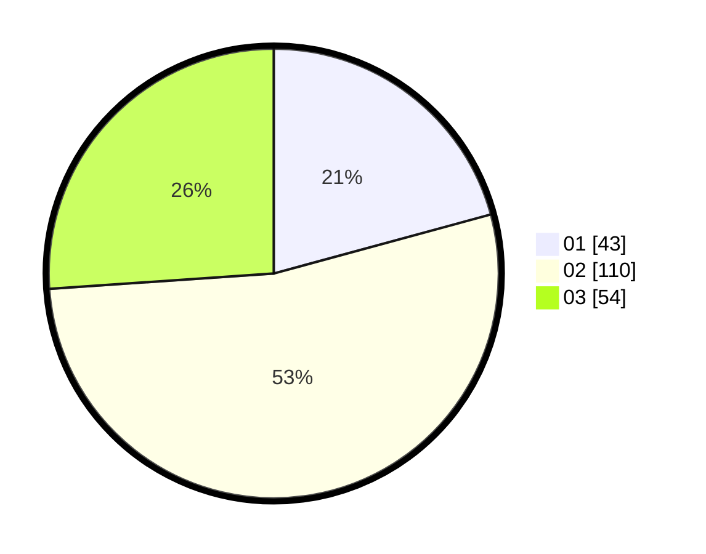

# Hasil

Hasil perolehan suara paslon dapat dilihat pada file paslon-01.txt, paslon-02.txt, dan paslon-03.txt.

Jika tidak ada, artinya data tersebut belum ada pada SIREKAP.

## Perolehan Suara

 * Paslon 01: **43**.
 * Paslon 02: **110**.
 * Paslon 03: **54**.

## Foto C Plano

https://sirekap-obj-formc.kpu.go.id/c928/pemilu/ppwp/31/75/05/10/05/3175051005132-20240214-211945--7c2def47-261a-44a1-982c-6ce8265de415.jpg

https://sirekap-obj-formc.kpu.go.id/c928/pemilu/ppwp/31/75/05/10/05/3175051005132-20240214-212039--91d9fea4-5ec8-4f85-8bc3-3bcfa84a5597.jpg

https://sirekap-obj-formc.kpu.go.id/c928/pemilu/ppwp/31/75/05/10/05/3175051005132-20240214-212201--c9178e32-ca6d-4dba-9134-5c0f3ef8257b.jpg

## DATA PEMILIH TETAP

Jumlah pemilih dalam DPT: **279**.
 * L: **137**.
 * P: **142**.

## DATA PENGGUNA HAK PILIH

Jumlah pengguna hak pilih dalam DPT: **208**.
 * L: **101**.
 * P: **107**.

Jumlah pengguna hak pilih dalam DPTb: **1**.
 * L: **1**.
 * P: **0**.

Jumlah pengguna hak pilih dalam DPK: **1**.
 * L: **1**.
 * P: **0**.

Jumlah pengguna hak pilih: **210**.
 * L: **103**.
 * P: **107**.

## JUMLAH SUARA SAH DAN TIDAK SAH

JUMLAH SELURUH SUARA SAH: **207**.

JUMLAH SUARA TIDAK SAH: **3**.

JUMLAH SELURUH SUARA SAH DAN SUARA TIDAK SAH: **210**.
