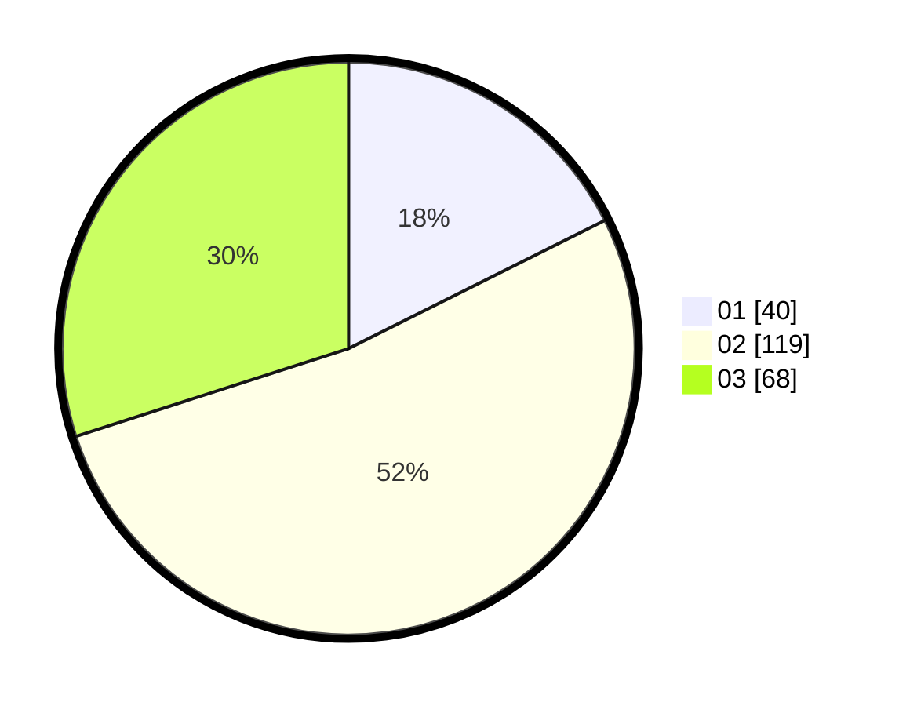

# Hasil

Hasil perolehan suara paslon dapat dilihat pada file paslon-01.txt, paslon-02.txt, dan paslon-03.txt.

Jika tidak ada, artinya data tersebut belum ada pada SIREKAP.

## Perolehan Suara

 * Paslon 01: **40**.
 * Paslon 02: **119**.
 * Paslon 03: **68**.

## Foto C Plano

https://sirekap-obj-formc.kpu.go.id/aaad/pemilu/ppwp/31/75/05/10/05/3175051005133-20240216-113440--d49305e1-778d-4786-97c8-a82fea6f09f9.jpg

https://sirekap-obj-formc.kpu.go.id/aaad/pemilu/ppwp/31/75/05/10/05/3175051005133-20240216-220952--2bbe55cd-3140-4723-9b3f-cc6616867aa6.jpg

https://sirekap-obj-formc.kpu.go.id/aaad/pemilu/ppwp/31/75/05/10/05/3175051005133-20240216-221202--79d27a0e-5c05-445b-9713-2fb6c973d0cb.jpg
