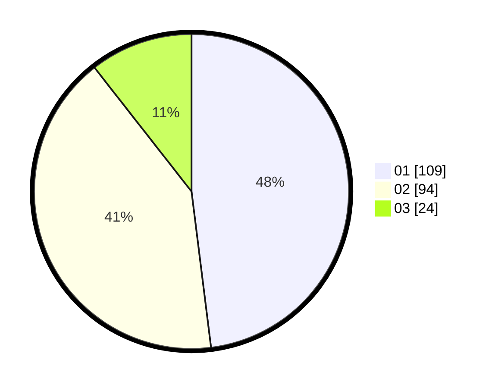

# Hasil

Hasil perolehan suara paslon dapat dilihat pada file paslon-01.txt, paslon-02.txt, dan paslon-03.txt.

Jika tidak ada, artinya data tersebut belum ada pada SIREKAP.

## Perolehan Suara

 * Paslon 01: **109**.
 * Paslon 02: **94**.
 * Paslon 03: **24**.

## Foto C Plano

https://sirekap-obj-formc.kpu.go.id/05f0/pemilu/ppwp/31/75/05/10/05/3175051005135-20240214-215716--94f523c4-3c4b-46aa-9ac2-529d37aef87d.jpg

https://sirekap-obj-formc.kpu.go.id/05f0/pemilu/ppwp/31/75/05/10/05/3175051005135-20240214-222026--171b2dab-7210-49e0-895a-45bc9a521f0b.jpg

https://sirekap-obj-formc.kpu.go.id/05f0/pemilu/ppwp/31/75/05/10/05/3175051005135-20240214-205409--b2fa5554-d217-4ad4-b6ce-c19f72c1bcfb.jpg

## DATA PEMILIH TETAP

Jumlah pemilih dalam DPT: **271**.
 * L: **139**.
 * P: **132**.

## DATA PENGGUNA HAK PILIH

Jumlah pengguna hak pilih dalam DPT: **231**.
 * L: **114**.
 * P: **117**.

Jumlah pengguna hak pilih dalam DPTb: **0**.
 * L: **0**.
 * P: **0**.

Jumlah pengguna hak pilih dalam DPK: **0**.
 * L: **0**.
 * P: **0**.

Jumlah pengguna hak pilih: **231**.
 * L: **114**.
 * P: **117**.

## JUMLAH SUARA SAH DAN TIDAK SAH

JUMLAH SELURUH SUARA SAH: **227**.

JUMLAH SUARA TIDAK SAH: **4**.

JUMLAH SELURUH SUARA SAH DAN SUARA TIDAK SAH: **231**.
