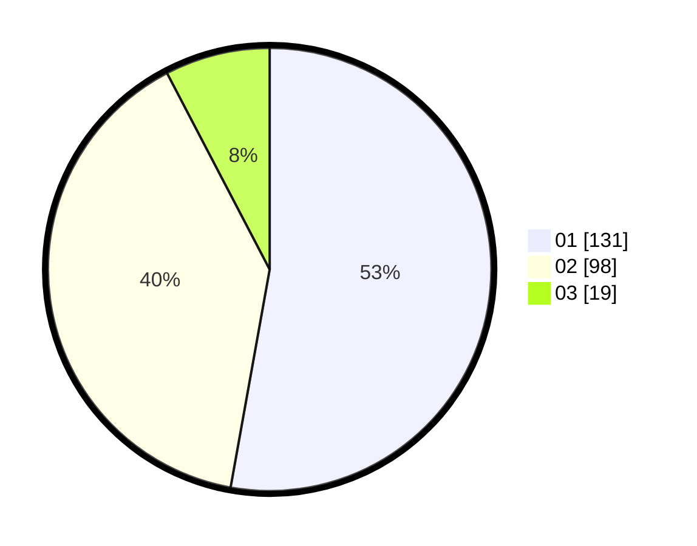

# Hasil

Hasil perolehan suara paslon dapat dilihat pada file paslon-01.txt, paslon-02.txt, dan paslon-03.txt.

Jika tidak ada, artinya data tersebut belum ada pada SIREKAP.

## Perolehan Suara

 * Paslon 01: **131**.
 * Paslon 02: **98**.
 * Paslon 03: **19**.

## Foto C Plano

https://sirekap-obj-formc.kpu.go.id/3974/pemilu/ppwp/31/75/05/10/05/3175051005136-20240215-002935--416d68de-5d67-4361-9485-0eb956545cc4.jpg

https://sirekap-obj-formc.kpu.go.id/3974/pemilu/ppwp/31/75/05/10/05/3175051005136-20240215-003122--7f9d0bd4-f565-4b58-9d96-b5c65ce84e28.jpg

https://sirekap-obj-formc.kpu.go.id/3974/pemilu/ppwp/31/75/05/10/05/3175051005136-20240215-003244--f6bc71e2-aa49-4e0b-ab3a-e9d3a574af23.jpg

## DATA PEMILIH TETAP

Jumlah pemilih dalam DPT: **277**.
 * L: **137**.
 * P: **140**.

## DATA PENGGUNA HAK PILIH

Jumlah pengguna hak pilih dalam DPT: **277**.
 * L: **137**.
 * P: **140**.

Jumlah pengguna hak pilih dalam DPTb: **0**.
 * L: **0**.
 * P: **0**.

Jumlah pengguna hak pilih dalam DPK: **2**.
 * L: **1**.
 * P: **1**.

Jumlah pengguna hak pilih: **279**.
 * L: **138**.
 * P: **141**.

## JUMLAH SUARA SAH DAN TIDAK SAH

JUMLAH SELURUH SUARA SAH: **248**.

JUMLAH SUARA TIDAK SAH: **4**.

JUMLAH SELURUH SUARA SAH DAN SUARA TIDAK SAH: **252**.
