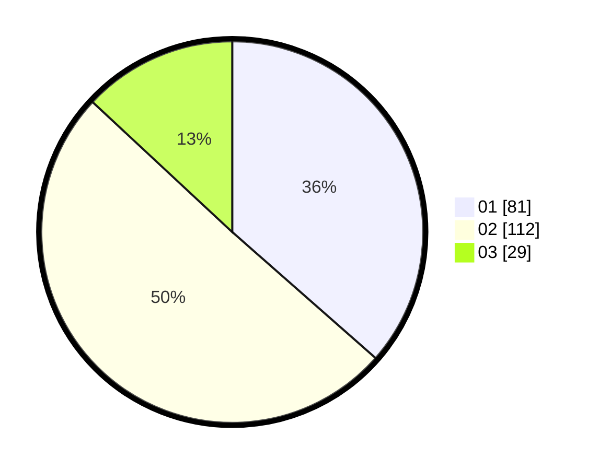

# Hasil

Hasil perolehan suara paslon dapat dilihat pada file paslon-01.txt, paslon-02.txt, dan paslon-03.txt.

Jika tidak ada, artinya data tersebut belum ada pada SIREKAP.

## Perolehan Suara

 * Paslon 01: **81**.
 * Paslon 02: **112**.
 * Paslon 03: **29**.

## Foto C Plano

https://sirekap-obj-formc.kpu.go.id/997b/pemilu/ppwp/31/75/05/10/05/3175051005141-20240215-174809--2d623b03-cef3-4926-9acd-9b74caa92717.jpg

https://sirekap-obj-formc.kpu.go.id/997b/pemilu/ppwp/31/75/05/10/05/3175051005141-20240215-102626--e8ce3fdf-4bf3-4a76-b227-0bc512018bd2.jpg

https://sirekap-obj-formc.kpu.go.id/997b/pemilu/ppwp/31/75/05/10/05/3175051005141-20240216-110449--e2ccb17f-aa08-4de5-bbc6-48a061f64d27.jpg

## DATA PEMILIH TETAP

Jumlah pemilih dalam DPT: **266**.
 * L: **137**.
 * P: **129**.

## DATA PENGGUNA HAK PILIH

Jumlah pengguna hak pilih dalam DPT: **223**.
 * L: **111**.
 * P: **112**.

Jumlah pengguna hak pilih dalam DPTb: **0**.
 * L: **0**.
 * P: **0**.

Jumlah pengguna hak pilih dalam DPK: **6**.
 * L: **2**.
 * P: **4**.

Jumlah pengguna hak pilih: **229**.
 * L: **113**.
 * P: **116**.

## JUMLAH SUARA SAH DAN TIDAK SAH

JUMLAH SELURUH SUARA SAH: **222**.

JUMLAH SUARA TIDAK SAH: **7**.

JUMLAH SELURUH SUARA SAH DAN SUARA TIDAK SAH: **229**.
